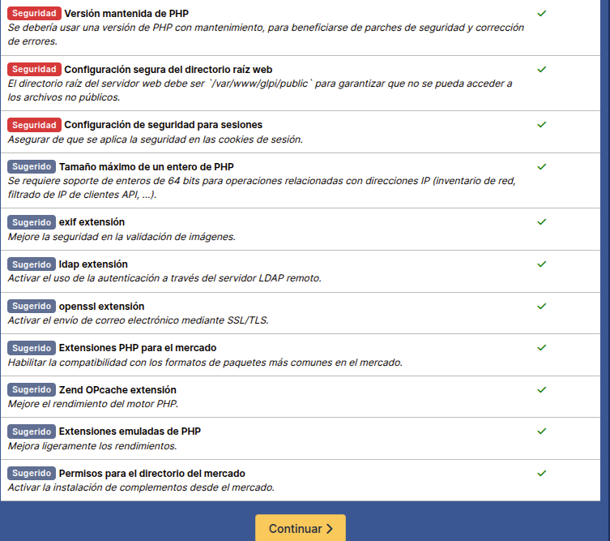
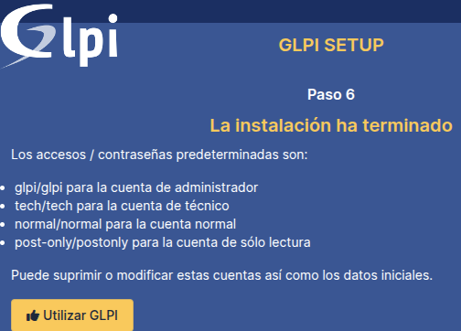
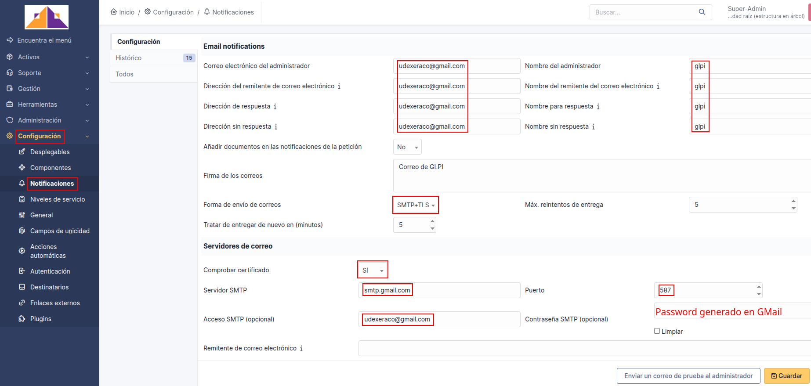

# PROYECTO FINAL DEL CICLO ASIX (Proyecto SIGEI-GLPI)

## 1 - Introducción del proyecto

### 1.1 - Descripción del proyecto

- El presente proyecto tiene por objeto crear una **aplicación web de Código abierto** que permita llevar el **control** de los equipos informáticos del **Instituto JaumeII El Just** y sobre todo mantener un **historial ordenado** de todo lo que ocurre con el **soporte técnico.**

### 1.2 - Objetivos del proyecto

- Tener un **inventario completo** de los dispositivos tecnológicos del centro.
- Gestionar **incidencias** o problemas técnicos de manera ordenada.
- Crear **códigos QR** para gestionar puntualmente vía móvil esas incidencias o consultas.
- Asignar tareas **vía email al grupo de Mantenimiento** y hacer **seguimiento** de su resolución.
- Obtener reportes útiles sobre el **estado del sistema** y los equipos.
- Mejorar la **atención al profesorado y alumnado interno** del centro.

## 2 - Análisis de opciones y requisitos vistos para considerar

### 2.1 - Snipe-IT


**Snipe-IT** es una **aplicación web de código abierto** diseñada para la **gestión de activos de TI** (Information Technology, hardware, software,...). Es una solución popular entre empresas y organizaciones que buscan una herramienta flexible y personalizable para rastrear y administrar sus activos de **hardware y software.**

#### 2.1.1 - Enfoque

- Principalmente una herramienta de gestión de activos de TI (**Information Technology**).
- Sobresale en el **seguimiento** de activos de hardware y software, **licencias** e información relacionada.

#### 2.1.2 - Fortalezas

- Interfaz **fácil** de usar.
- Sólidas capacidades de seguimiento de activos.
- Ideal para organizaciones que necesitan un **inventario detallado** de hardware y software.
- Muy bueno en la gestión de licencias, control de equipos y recursos de la organización
- Muy bueno en el rastreo de los activos con **códigos de barras y códigos QR.**

#### 2.1.3 - Limitaciones

- Menos robusto en áreas como la gestión de solicitudes de soporte técnico de los usuarios, en la creación y seguimiento de incidencias, asignación a grupos de mantenimiento, gestión de prioridades, etc.., en comparación con **GLPI.**


### 2.2 - GLPI ( Gestionnaire Libre de Parc Informatique)


Un software **gratuito y open-source** para gestionar activos de TI (**Information Tchnology, hardware, software,...**).
GLPI permite **administrar inventarios** de equipos, **seguimiento de problemas** y **gestión de tareas** relacionadas con el **mantenimiento** y soporte de **sistemas informáticos**; o sea atender, ayudar, solucionar y rastrear problemas e incidencias (**tickets**).

#### 2.2.1 - Enfoque

- Una **suite integral** de gestión de servicios de TI (Information Technology).
- Incluye **gestión de activos e incidencias y asignación de prioridades** de ayuda.

#### 2.2.2 - Fortalezas

- **GLPI** es un **software libre** para la gestión de TI (Information Technology), destacando por su **personalización, automatización de peticiones e incidencias y ampliamente utilizado por empresas para optimizar la gestión de su infraestructura tecnológica.**
- Centraliza **activos, inventario y soporte** en una sola plataforma.

#### 2.2.3- Limitaciones

- Puede tener una curva de aprendizaje **más pronunciada.**
- La interfaz puede considerarse **menos moderna** que la de **Snipe-IT**

## 3 - Decisión: GLPI

### 3.1 - Motivos

**Es una elección **más sólida** que Snipe-IT, ya que ofrece un conjunto más completo de **herramientas**, para gestionar:**

- **Incidencias técnicas** (equipos, software, etc.).
- **Problemas recurrentes** y cambios en la infraestructura.
- **Escalabilidad:** Crece junto con las necesidades del centro.
- **Control detallado:** Inventario de equipos y licencias.
- **Comunidad activa:** Actualizaciones constantes y soporte.
- **Trayectoria global:** Ampliamente usado en Europa y Latinoamérica.
- **Multilingüe y flexible:** Se adapta a entornos educativos diversos.

## 4 - Escenario con AWS


### 4.1 - Diagrama de arquitectura


## 5 - Escenario definitivo con Proxmox


### 5.1 Diagrama de arquitectura


## 6 - Instalación y configuración de las herramientas a utilizar

### 6.1 - AWS con Ubuntu Server 24.04

**La instancia de AWS será la MV en la nube que nos alojará las siguientes herramientas que necesitaremos en nuestro proyecto, manejando toda la lógica, el almacenamiento y la generación de contenido.**

**Ubuntu-server será el sistema operativo que nos proporcionará la base para ejecutar los servicios.**

 

#### Creación de una instancia EC2 en AWS

- **Paso 1. Iniciamos el laboratorio.**

  - Desde el curso de AWS Academy iniciamos el laboratorio pulsando en Start Lab y esperamos a que el icono que aparece junto al texto de AWS se ponga de **color verde**.


- **Paso 2.Accedemos a la consola de Administración de AWS.**
  - Desde la consola seleccionamos el servicio de **EC2**.


- **Paso 3. Buscamos el botón "Launch Instance" para crear una instancia EC2.**


- **Paso 4. Le asignamos un nombre a la instancia EC2 que vamos a crear.**


- **Paso 5. Seleccionamos la AMI y la arquitectura de la instancia EC2.**
  - En este paso tenemos que seleccionar la **AMI** (Amazon Machine Image) y la arquitectura. Para mi proyecto voy a seleccionar la imagen **Ubuntu Server 24.04 LTS (HVM), SSD Volume Type**, y la **arquitectura 64 bits (x86).**


- **Paso 6. Seleccionamos el tipo de instancia EC2.**
  - Seleccionamos que vamos a crear una instancia de tipo **t2.micro.** que cuenta con 1 vCPU y 1 GiB de RAM.


- **Paso 7. Seleccionamos la clave pública SSH que le vamos a inyectar a la instancia EC2.**

  - En este ejemplo vamos a utilizar la clave pública **vockey** que está asociada a nuestra cuenta de usuario en la plataforma AWS Learner Lab. La clave privada la descargaremos más adelante desde la plataforma, para poder conectarnos por SSH con la instancia EC2.


- **Paso 8. Configuramos los grupos de seguridad.**
- En este proyecto vamos a crear un nuevo grupo de seguridad y vamos a utilizar tres reglas para permitir tráfico **SSH, HTTP y HTTPS.**
  - SSH. Protocolo: TCP. Puerto: 22. Origen: 0.0.0.0/0
  - HTTP. Protocolo: TCP. Puerto: 80. Origen: 0.0.0.0/0
  - HTTPS. Protocolo: TCP. Puerto: 443. Origen: 0.0.0.0/0


- **Paso 9. Añadimos el almacenamiento que utilizará la instancia.***
  - En este paso configuramos cuál será el almacenamiento que utilizará la instancia EC2 que estamos creando.
  - Para nuestro ejemplo en el proyecto no vamos a modificar ninguno de los parámetros que aparecen por defecto y utilizaremos un disco SSD de 8 GB.


- **Paso 10. Revisamos la configuración seleccionada.**
  - Para crear la instancia pinchamos sobre el botón **Lanuch Instance.**


- **Paso 11. Estado de la instancia.**
  - En este paso nos aparece un mensaje indicando que la instancia se está creando.
    **Pincharemos sobre el identificador de la instancia que aparece en el cuadro de color verde.**


- **Paso 12. Consultaremos el estado de la instancia desde la consola de administración.**
  - Cuando pasen unos segundos le aparecerá en la consola la instancia que acaba de crear.
  - Cuando la instancia muestre que está en estado **Running** es que está preparada para
conectarnos a ella.


#### Nos conectamos a la instancia por SSH para ejecutar los comandos de instalación de las herramientas del proyecto

- **Paso 1. Seleccionamos la instancia y pinchamos sobre "Conectar".**


- **Paso 2. Vamos a obtener el comando para conectarnos desde un cliente SSH en Linux.**
  - En este paso nos aparece cómo podemos conectarnos a la instancia que acabamos de crear.
  - Seleccionaremos la opción **SSH client**, y veremos los pasos que tenemos que realizar para conectarnos a la instancia.
  - El comando que tenemos que utilizar para conectarnos a la instancia lo podemos copiar en este paso. En el comando aparece el nombre del archivo **.pem** de la clave privada (que hemos creado), el nombre del usuario y el nombre DNS público de la instancia.


- En nuestro caso al **crear par de claves** ya las hemos ubicado en el directorio **Música**, pero se pueden descargar pinchando sobe el texto **AWS Details** y le aparecerá en la parte derecha la posibilidad de descargar la clave como un archivo**.PEM o .PPK.**

- En Linux utilizaremos la clave **.PEM**, cuando descarguemos la clave se descargará como **nombre.pem o nombre.ppk.**


**Paso 3. Nos conectamos por SSH desde Linux.**

- Cambiamos los permisos del archivo para que solo el propietario tenga permisos de lectura.

  ```bash
  sudo chmod 400 clave_aws.pem
  ```

- Ejecutamos el comando que copiamos en el **paso 2** para conectarnos por SSH a la instancia EC2 desde un terminal de Linux.
- El comando será parecido al este, pero el nombre DNS de la instancia será diferente.

  ```bash
  sudo ssh -i "clave_AWS.pem" ubuntu@ec2-34-239-105-173.compute-1.amazonaws.com
  ```


### 6.2 - (Instalación definitiva ) Proxmox con Ubuntu Server 24.04

#### 6.2.1 - Instalación de Proxmox

- **Paso 1.** Descargar la ISO de Proxmox VE.
  - Desde la web oficial: <https://www.proxmox.com/en/downloads>
- **Paso 2.** Crear un USB booteable.
  - Usaremos herramientas como **Rufus** (Windows) o **balenaEtcher** (Linux/macOS).
- **Paso 3.** Arrancar desde el USB.
  - Encendemos el servidor o PC y entramos en la **BIOS/UEFI** para arrancar desde el USB.
- **Paso 4.** Iniciamos la instalación.
  - Selecciona **"Install Proxmox VE"** en el menú que aparece.

    

- **Paso 5.** Aceptar licencia y disco de instalación.

  

- **Paso 6.** Configurar región y teclado .

  

- **Paso 7.** Crear contraseña de root y correo electrónico.

  

- **Paso 8.** Configurar red.

  

- **Paso 9.** Finalizar instalación y reiniciar.
  - Cuando terminemos, **retiramos el USB y reiniciamos.**
  
    
    

- **Paso 10.** Accedemos a la interfaz web (después del reinicio.
  - Abre un navegador y entramos en: `https://[IP-del-servidor]:8006`.

    

#### 6.2.2 - Creación de la MV Ubuntu Server en Proxmox

- **Paso 1.** Cargar ISO a Proxmox VE una vez hemos accedido a la interfaz web.

  

- **Paso 2.** Esto abrirá la ventana emergente de carga. Seleccionaremos **Imagen ISO.**
Desde el menú desplegable de contenido, seleccionaremos el archivo ISO que deseamos cargar.
Haremos clic en el botón **Upload** para cargar el archivo **ISO.**

   

- **Paso 3.** Crearemos la MV una vez cargado el archivo ISO.

  

- **Paso 4.** En la pestaña **General** asignaremos un nombre a la MV.
  
  

- **Paso 5.** En la pestaña **OS** elegimos la imagen ISO que hemos subido.
  
  

- **Paso 6.** En la pestaña **System** dejaremos la configuración **predeterminada.**

  

- **Paso 7.** En la pestaña **Disk** seleccionaremos el **disco** de almacenamiento y el **tamaño** del disco de la MV.  

  

- **Paso 8.** En la pestaña **CPU** seleccionaremos el número de **núcleos** de CPU que deseamos asignar a la MV.

  

- **Paso 9.** En la pestaña **Memory** asignaremos la cantidad de **RAM** para la MV.
  - Como estamos realizando pruebas en **VirtualBox** con **2 niveles de virtualización** asignaremos más cores y RAM para que pueda funcionar.

  

- **Paso 10.** En la pestaña **Network** dejaremos la configuración **predeterminada.**

  

- **Paso 11.** En la pestaña **Confirm** revisaremos la configuración de la MV y finalizaremos.

  

- **Paso 12.** Instalaremos el **SO** en la **MV.**

  

- **Paso 13.** Se abrirá una consola virtual que usaremos para instalar el **SO** que queramos, siguiendo las instrucciones del instalador.

  

### 6.3 - Creación de la pila LAMP (Linux, Apache, MariaDB y PHP)

#### 6.3.1 - Instalación de Apache


**Será el servidor web que nos gestionará las solicitudes HTTP y nos proporcionará las páginas web.**

- **Paso 1. Instalamos:**

    ```bash
    sudo apt update
    sudo apt install apache2 -y
    ```

- **Paso 2. Realizamos un backup de nuestro 000-defaults.conf**

    ```bash
    sudo mv /etc/apache2/sites-available/000-default.conf /etc/apache2/sites-available/000-default.conf.bkp
    ```

- **Paso 3. Creamos un archivo de configuración (glpi.conf) para el sitio de GLPI en Apache como nos indica la "Documentación Oficial de GLPI".**

    <https://glpi-install.readthedocs.io/en/latest/prerequisites.html#web-server>

**GLPI recomienda no colocarlo en el directorio por default de Apache "/var/www/html", sugiere colocarlo por fuera por lo cual lo colocaremos en "/var/www".**

`sudo nano /etc/apache2/sites-available/glpi.conf`

```bash
<VirtualHost *:80>
    ServerName edu.com
    DocumentRoot /var/www/glpi/public

    <Directory /var/www/glpi/public>
        Options -Indexes +FollowSymLinks
        AllowOverride All
        Require all granted
        RewriteEngine On
        # Redirect all requests to GLPI router, unless file exists.
        RewriteCond %{REQUEST_FILENAME} !-f
        RewriteRule ^(.*)$ index.php [QSA,L]
    </Directory>

    ErrorLog ${APACHE_LOG_DIR}/glpi-error.log
    CustomLog ${APACHE_LOG_DIR}/glpi-access.log combined

</VirtualHost>    
```

- **Paso 4. Habilitamos el archivo .conf que hemos creado y habilitamos el modulo rewrite.**

    ```bash
    sudo a2ensite glpi.conf
    sudo a2enmod rewrite
    ```

- **Paso 5. Recargamos, activamos y reiniciamos apache2.service**

    ```bash
    sudo systemctl reload apache2.service
    sudo systemctl enable apache2.service
    sudo systemctl restart apache2.service
    ```

#### 6.3.2 - Instalación de PHP


**Será el lenguaje de programación que ejecutará el código de GLPI y nos generará las páginas dinámicas.**

- **Paso 1. Instalaremos los repositorios de php y actualizaremos.**

    ```bash
    sudo apt install software-properties-common apt-transport-https -y
    sudo add-apt-repository ppa:ondrej/php -y
    sudo apt update
    ```

- **Paso 2. Instalamos la versión de php que nos indica la "Documentación Oficial de GLPI", los paquetes necesarios y reiniciamos.**

    <https://glpi-install.readthedocs.io/en/latest/prerequisites.html#php>

    

    ```bash
    sudo apt install php8.3 php8.3-cli php8.3-common libapache2-mod-php8.3 -y
    sudo apt install libapache2-mod-fcgid php8.3-fpm -y
    sudo systemctl restart apache2.service
    ```

- **Paso 3. Activamos variable "session.cookie_httponly" a "on" en "/etc/php/8.3/fpm/php.ini" y reiniciamos.**

    ```bash
    sudo nano /etc/php/8.3/fpm/php.ini
    ```

    Buscamos con el editor la variable **session.cookie =** y la activamos con **on**.

    Es una medida de seguridad importante para **proteger las sesiones de usuario** en aplicaciones web PHP.

    Ayuda a prevenir el **robo de cookies y la suplantación de identidad.** Se recomienda **habilitar** esta directiva en todos los entornos de producción.

    ```bash
    sudo systemctl restart php8.3-fpm
    ```

- **Paso 4. Habilitamos funciones instaladas de php, habilitamos la función "fpm" y recargamos-reiniciamos**

    ```bash
    sudo a2enmod proxy_fcgi setenvif
    sudo a2enconf php8.3 -fpm
    sudo systemctl reload apache2.service
    sudo systemctl restart apache2.service
    ```

**Instalamos la extensiones y dependencias que vamos a necesitar para la posterior instalación de "GLPI".**

```bash
sudo apt install -y php8.3-{curl,gd,imagick,intl,apcu memcache,imap,mysqli,ldap,tidy,xmlrpc,pspell,gettext,mbstring,fpm,iconv,xml,xsl,bz2,Phar,zip,exif}
```

#### 6.3.3 - Instalación de MariaDB


**Será la BBDD que nos almacenará los datos de GLPI.**

- **Paso 1.Instalamos mariadb-server y securizamos.**

    Seguimos los pasos, colocamos una nueva contraseña para el usuario **root** de la BBDD, eliminamos las BBDD de prueba y eliminamos el acceso a usuarios anónimos **(Enter--n--y--Enter-pass--Re-enter-pass--y--y--y--y).**

    ```bash
    sudo apt install mariadb-server -y
    sudo mysql_secure_installation
    ```

- **Paso 2. Creamos una BBDD en nuestro caso "glpi", un usuario para GLPI en MariaDB, damos privilegios y además activaremos la zona horaria en mysql.**

    Podemos cambiar los datos que deseemos, **nombre de  usuario y BBDD**, y colocaremos una contraseña apropiada.

    ```bash
    sudo mysql -u root -p
    CREATE DATABASE glpi; 
    CREATE USER '<nomuser>'@'%' IDENTIFIED BY <'passuser'>;
    GRANT ALL PRIVILEGES ON glpi.* TO '<nomuser>'@'%';
    GRANT SELECT ON mysql.time_zone_name TO '<nomuser>'@'%';
    flush privileges;
    exit;
    ```

- **Paso 3. Cargamos las zonas horarias del sistema (introducimos la contraseña de root).**

    ```bash
    sudo mysql_tzinfo_to_sql /usr/share/zoneinfo | sudo mysql -u root -p mysql
    ```

### 6.4 - Descarga e instalación de GLPI


**Será la aplicación que se instalará en el servidor y que nos gestionará los activos de TI con todos los servicios que nos ofrece.**

- **Paso 1. Procederemos desde su sitio oficial, la última versión para la fecha es la "10.0.18".**

    <https://glpi-project.org/es/descargar-software/>

    ```bash
    wget https://github.com/glpi-project/glpi/releases/download/10.0.18/glpi-10.0.18.tgz
    ```

- **Paso 2. Descomprimimos el archivo y lo movemos (-C) al directorio "/var/www"**
    Posteriormente eliminaremos el fichero **.tgz**, que no lo necesitaremos y el **index.html** para no tener problemas.

    ```bash
    sudo tar -zxvf glpi-10.0.18.tgz -C /var/www/
    sudo rm -rf glpi-10.0.18.tgz 
    sudo rm -rf /var/www/html/index.html
    ```

- **Paso 3. Le damos al usuario de apache la propiedad de la carpeta y permisos.**

    ```bash
    sudo chown -R www-data:www-data /var/www/glpi
    sudo chmod -R 755 /var/www/glpi
    ```

- **Paso 4 (opcional). Si queremos cambiar los logotipos de GLPI, tendremos que tener en el $HOME de nuestro servidor el logo-master que cambiará los de la aplicación.**

    Una vez consultada la **página oficial** de las recomendaciones para determinar el tamaño **(pixel)** de los logos de cada sitio, procederemos a crearlos.
  
    <https://glpi-plugins.readthedocs.io/en/latest/branding/index.html>

    Tendremos que tener instalado en el sistema **imagemagick** para poder crear con el comando **converter** los ficheros de imagen de los logos con los tamaños que se nos indica.

    `sudo apt install imagemagick -y`

    Haremos un **backup de los logos originales** de la aplicación.

    ```bash
    sudo mv /var/www/glpi/pics/favicon.ico /var/www/glpi/pics/favicon.ico.bkp
    sudo mv /var/www/glpi/pics/logos/logo-GLPI-100-white.png /var/www/glpi/pics/logos/logo-GLPI-100-white.png.bkp
    sudo mv /var/www/glpi/pics/logos/logo-GLPI-250-black.png /var/www/glpi/pics/logos/logo-GLPI-250-black.png.bkp
    ```

    Crearemos los **ficheros de imagen** de los logos con los **tamaños requeridos (pixeles)** que vamos a necesitar.

    ```bash
    sudo convert $HOME/<logo-master> -resize 32x32\! favicon.ico
    sudo convert $HOME/<logo-master> -resize 100x55\! logo-GLPI-100-white.png
    sudo convert $HOME/<logo-master> -resize 220x130\! logo-GLPI-250-black.png
    ```

    Cambiamos los **permisos** de los ficheros creados a **755.**

    ```bash
    sudo chmod 755 favicon.ico
    sudo chmod 755 logo-GLPI-100-white.png
    sudo chmod 755 logo-GLPI-250-black.png
    ```

    Copiamos los ficheros de imagen creados de los logos a sus **respectivas rutas.**

    ```bash
    sudo cp favicon.ico /var/www/glpi/pics/
    sudo cp logo-GLPI-100-white.png /var/www/glpi/pics/logos/
    sudo cp logo-GLPI-250-black.png /var/www/glpi/pics/logos/
    ```

    Cambiamos el propietario y el grupo de todos los ficheros a **www-data.**

    ```bash
    sudo chown www-data:www-data /var/www/glpi/pics/favicon.ico
    sudo chown www-data:www-data /var/www/glpi/pics/favicon.ico.bkp
    sudo chown www-data:www-data /var/www/glpi/pics/logos/logo-GLPI-100-white.png
    sudo chown www-data:www-data /var/www/glpi/pics/logos/logo-GLPI-100-white.png.bkp
    sudo chown www-data:www-data /var/www/glpi/pics/logos/logo-GLPI-250-black.png
    sudo chown www-data:www-data /var/www/glpi/pics/logos/logo-GLPI-250-black.png.bkp
    ```

**Hay que tener en cuenta que para que se aplique en su momento el cambio de los "logos" tendremos que "ELIMINAR-BORRAR LOS DATOS DEL NAVEGADOR".**

**En este momento ya tenemos instalados todos los componentes para ejecutar GLPI abriendo un navegador contra nuestro GLPI, <<http://IP> de nuestro servidor.**

### 6.5 - Asistente de configuración de GLPI

- **Paso 1.** Si todo ha ido bien tendremos el asistente de configuración de GLPI, después de abrir ya un navegador contra nuestro GLPI, algo como **http://DIRECCION_IP del servidor**, lo primero, escogeremos el idioma a utilizar **& OK**.

- **Paso 2.** Leemos y aceptamos los términos de la licencia de GLPI & **Continuar**.

     

- **Paso 3.** Pulsamos en **Instalar** ya que estamos instalándolo por primera vez.

    

- **Paso 4.** Verificamos que cumplimos todos los requisitos y están todos correctos.

     

- **Paso 5.** Indicamos los datos del servidor de BBDD, indicamos **localhost o 127.0.0.1** e indicamos el **usuario y contraseña** de acceso a la BBDD **& Continuar**.

- **Paso 6.** Seleccionamos la BBDD que creamos anteriormente, llamada **glpi & Continuar**.

     

- **Paso 7.** Si conectó e inicializó la BBDD, pulsamos en **Continuar**.

- **Paso 8.** Podemos voluntariamente si queremos enviar las métricas de uso para que la comunidad de GLPI pueda mejorar el producto, en mi caso como son pruebas **desactivaré & Continuar**.

     

     

**Nos indica que existen unas cuentas de usuario ya predefinidas con distintos roles, desactivaremos en un futuro las cuentas y cambiaremos su contraseña. Estas cuentas serían:**

- **Administrador:** glpi-glpi

- **Técnico:** tech-tech

- **Cuenta sólo lectura:** post-only-postonly

- **Cuenta normal:** normal-normal

Inicialmente **Acceso y Contraseña** serán **glpi**

 

### 6.6 - Documentación funcional de GLPI

#### 6.6.1 - Crear usuarios

**Un usuario es una persona que va a usar GLPI. Puede ser:**

- Un técnico de soporte.

- Un administrativo que genera tickets.

- Un responsable que autoriza compras.

- O simplemente alguien que reporta incidencias.

**Opcional pero recomendable:**

- Darle un **perfil** (rol):

  - Por ejemplo: "Self-Service", "Técnico", "Administrador".

    

    

#### 6.6.2 - Crear grupos

**Crear grupos es una manera muy útil de organizar usuarios, asignar permisos más fácilmente, o estructurar equipos según proyectos, departamentos, etc.**

- **Accedemos a GLPI**
  - Iniciamos sesión con un usuario que tenga permisos de administrador.

- **Vamos al menú de "Administración"**
  - En el menú de la izquierda, hacemos clic en:
    - **Administración > Grupos**

- **Hacemos clic en el botón "Añadir" (o el símbolo de +).**

  - Se abrirá un formulario para crear el grupo.

- **Rellenaremos los datos del grupo.**

  - Una vez rellenado todo, haremos clic en "Añadir" o "Guardar".


- **Asignamos usuarios al grupo.**

  - Después de crearlo, dentro del grupo puedes ir a la pestaña **Usuarios** y pulsamos **"Añadir".**

  - Elegiremos los usuarios que queremos agregar a ese grupo.


#### 6.6.3 - Gestión de perfiles

**Un perfil define lo que el usuario puede hacer y ver. Es como un “rol” o “permiso”.**

Algunos ejemplos que vienen por defecto:

- **Self-Service:** Solo reporta tickets y ve los suyos.
- **Technician:** Ve y gestiona tickets asignados.
- **Supervisor:** Ve todos los tickets de su grupo.
- **Admin:** Tiene acceso completo.
- **Read-Only:** Solo puede ver, no tocar nada.

Podemos crear **perfiles personalizados,** por ejemplo:

- *Un perfil que solo puede ver inventario.*
- *Otro que solo puede aprobar compras, etc...*


- Le asignamos dentro de cada **apartado** los **permisos** que deseamos para cada perfil o como hemos dicho anteriormente **creamos** un perfil con **permisos personalizados.**


#### 6.6.4 - Gestión de GMail como nuestro servidor de correo

**Google ha endurecido el proceso para enviar emails desde aplicaciones externas. Por este motivo recomendable tenemos que crear una \textcolor{red}{contraseña de aplicación} exclusiva para GLPI. No sustituye nuestra contraseña de GMail, se trata de una nueva que solamente sirve para enviar emails desde GLPI.**

##### 6.6.4.1 - Configurar la cuenta de GMail para que funcione con GLPI

- **Antes de nada, necesitamos una cuenta de GMail que será usada para enviar los correos:**

- **Crearemos una cuenta GMail** (si no tenemos una dedicada para GLPI, es recomendable que creemos una exclusiva).

- **Entrar a GMail** y configuraremos lo siguiente:

  - Abrimos GMail y hacemos clic en nuestra cuenta, arriba derecha. Después clic en **Gestionar tu cuenta de Google.**

    

  - Ahora clic en la sección **Seguridad** en la parte izquierda de la página.

    

  - En la parte media de la Página, en la sección **"Como inicias sesión en Google"**, **Verificación en dos pasos** (si no la tenemos ya), comprobaremos que lo tenemos **activado** para así poder crear la **contraseña de aplicación para GLPI.**

    

  - En la barra superior de búsqueda teclearemos Contraseñas de aplicación.

    

  - Introducimos el nombre de la aplicación que en nuestro caso será **GLPI** y    pulsamos en **Crear.**

    

    

  - Ahora ya hemos creado una nueva contraseña de aplicación exclusiva para enviar emails desde **GLPI**. Solamente para eso, **no sustituye** a tu contraseña de GMail.
  - **Quitaremos** los espacios generados entre los tramos de la contraseña y la guardaremos en un block de notas para posteriormente utilizarla en la **configuración del email de GLPI.**

##### 6.6.4.2 - Configurar la salida de correo (SMTP) en GLPI

**Ahora vamos a decirle a GLPI cómo usar esa cuenta de GMail para enviar correos.**

- Entraremos en **GLPI** como "Super-Admin".
- Iremos a **Configuración > Notificaciones > Configuración de los seguimientos por correo.**

- Rellenamos los datos y **guardamos:**

  

  

##### 6.6.4.3 - Configurar las notificaciones para que avisen al grupo

**Ahora vamos a configurar que cuando llegue una incidencia, se avise al grupo.**

- Iremos a **Configuración > Notificaciones > Notificaciones.**

- Buscaremos la notificación llamada **"Nueva petición"** (o "New Ticket").


- *Editamos esa notificación y guardamos.*


- En **Destinatarios** (Recipients) nos aseguramos de que seleccionamos el **grupo que nos interesa** y **actualizamos-guardamos.**


##### 6.6.4.4. - Automatizar las notificaciones

- Iremos a **Configuración > Acciones automáticas.**

- **Paso 1.** Buscaremos la acción **mailgate.**
  - La editamos y la **desactivamos** para que **no** nos recupere cada vez que se genere una notificación todas los correos almacenados y creados anteriormente (Guardar).

    

- **Paso 2.** Buscaremos las acciones **queuednotification** (Correos enviados a cola) y **queuednotificationclean** (Limpiar cola de notificaciones).
  - Cada acción debe tener:
    - **Modo de ejecución:** CLI
    - **Estado:** Programada
    - **Frecuencia:** el intervalo que desees (por ejemplo, cada 5 minutos, cada hora, etc.), aunque el cron que programaremos en el sistema marcará los intervalos reales de tiempo a ejecutar.

      

      

- **Paso 3.** Usaremos **CRON** agregando una entrada en el **crontab** del sistema.

  ```bash
  sudo crontab -e
  ```

- Añadiremos esto para que se ejecute cada **2 minutos:**

  ```bash
    */2 * * * * /usr/bin/php8.3 /var/www/glpi/front/cron.php &>/dev/null
  ```

El **front/cron.php, viene incluido con GLPI, es un script PHP oficial** que GLPI trae para gestionar las acciones automáticas.

#### 6.6.5 - Generación de códigos QR

Los **códigos QR** se generan para **almacenar y compartir información** de manera **rápida y accesible**.

Su uso es muy amplio y en nuestro proyecto **incluirá:**

- **Enlace al sitio web:** Nos facilitará el acceso a las páginas específicas sin necesidad de escribir la URL.

- **Información de los equipos:** Nos proporcionará detalles adicionales de cada equipo.

- **Fichero de Imagen.png:** Para guardar en la ficha del equipo inventariado y para adjuntar a fichero de texto para su posterior impresion y etiquetado de este.

En nuestro proyecto añadiremos una **extensión** a nuestro navegador **Google-Chrome** desde la **Web Store** de éste, en nuestro caso será:

 

- **Características principales:**

- Genera códigos QR a partir de texto libre y URLs al instante.
- Genera un código QR para tu página actual con un solo clic.
- Personalización de color y tamaño.
- Opción para descargar el código QR como una imagen (PNG/SVG/Código SVG).

Una vez posicionados en el registro de nuestro dispositivo-equipo, haremos un **click** en la **barra superior** del navegador en el **icono** de nuestra extension.

- Se nos abrirá la imagen de un código **QR** para poderlo descargar y guardar.


- A continuación se nos abrirá un **destino dentro de nuestros directorios** para poder elegir una **ubicación o una estructura** que para tal motivo tengamos creada y **guardándolo** para después **imprimirlo.**

#### 6.6.6 - Crear peticiones (incidencias)

Desde la **ficha del usuario** nos seleccionamos **Peticiones creadas >> "Nueva petición** para este elemento".


Aquí ya detallaremos el **tipo, categoría, estado, urgencia, etc...,** que una vez añadida se nos plasmará en el **panel** central.


### 6.7 - Instalación automatizada de los puntos 6.3 y 6.4

Para una instalación más **rápida y optimizada** de todo el proceso realizado en los puntos **6.3 y 6.4** y para configurar **automáticamente** algunas funcionalidades clave, podemos utilizar un script:

Puedes ver el script [aquí](./GLPI_script.md)

[Descargar el archivo](./GLPI_script.sh)

### 6.8 - Descarga e instalación de Visual Studio Code


**Editor de código fuente desarrollado por Microsoft, ligero, rápido y muy personalizable que utilizaremos para ajustar el documento del proyecto, nos ayudará a organizar nuestro contenido documentado, nos dará ideas de como unirlo y nos avisará si algo no encaja bien.**

- **Paso 1. Desde la web oficial descargaremos el paquete que corresponda con nuestro SO.**

    <https://code.visualstudio.com/download>

- **Paso 2. Ejecutaremos el instalador "desde el directorio en el cual lo hemos descargado" y seguiremos las instrucciones de éste, lo cual veremos detalladamente en un apartado aparte para este cometido.**

### 6.9 - Instalación de las extensiones en VScode para Markdown


**Markdown es un lenguaje de marcado ligero que nos permite dar formato a texto plano de manera sencilla, donde los cambios de formato se ven inmediatamente, Markdown utiliza una sintaxis simple para indicar cómo debe formatearse el texto sin usar botones ni menús.
Será el lenguaje que utilizaremos para describir el proyecto que nos proporcionará una forma fácil y rápida de escribir texto con formato (como títulos, negritas, listas o enlaces) usando solo el teclado, sin menús ni botones.**

- **Paso 1. Buscaremos e instalaremos las  extensiones desde la barra lateral izquierda, haciendo clic en el icono de Extensiones.**


- **Paso 2. Instalaremos las extensiones esenciales para trabajar con markdown.**

  - **Markdown All in One:**

  - Ofrece funciones como vista previa, atajos de teclado, autocompletado, lista de contenidos, y mucho más.

  - Muy útil para quienes trabajan extensamente con documentos Markdown.

  

  - ***Markdown Preview Enhanced:***
  
  - Esta extensión amplía la vista previa estándar de Markdown de VS Code.

  - Permite previsualizar diagramas, fórmulas matemáticas, archivos PDF, y otros elementos avanzados.

  - Es ideal para documentos Markdown complejos.
  
  

### 6.10 - Instalación de Tex Live


**Es una distribución de software que incluye todo lo necesario para trabajar con documentos en TeX y LaTeX.
Será el compilador para generar nuestro documento PDF del proyecto.**

Instalaremos la distribución de la **versión completa** que contiene todas las herramientas, ya que necesitamos **lualatex** como **motor** de procesamiento.

```bash
sudo apt update
sudo apt install texlive-full
```

### 6.11 - Instalación de Pandoc


**Es una herramienta de software libre y de código abierto que se utiliza para convertir documentos de un formato a otro.
Se le conoce como el "convertidor universal de documentos" debido a su amplia capacidad para manejar una gran variedad de formatos de entrada y salida y por tanto será el conversor que utilizaré para trasformar el documento del proyecto de Markdown a PDF.**

Es el **conversor** principal que transforma **Markdown en PDF.**

`sudo apt install pandoc -y`

### 6.12 - Instalación de la plantilla Eisvogel


**Herramienta que mejora la presentación de documentos convertidos desde markdown a pdf, por tanto será la plantilla que nos facilitará la mejora de calidad en la creación del documento final de nuestro proyecto.**

- **Paso 1. Descargaremos la última versión de la plantilla desde web "SOURCEFORGE".**

    <https://sourceforge.net/projects/eisvogel.mirror/>

    ```bash
    wget https://sourceforge.net/projects/eisvogel.mirror/files/latest/download
    ```

- **Paso 2. Descomprimimos la carpeta.**

    Posteriormente eliminaremos el fichero **.zip**, que no lo necesitaremos.

    ```bash
    sudo unzip Eisvogel-<version>.zip
    sudo rm -rf Eisvogel-<version>.zip
    ```

- **Paso 3. Copiamos el fichero "eisvogel.latex" dentro del directorio donde se encuentre nuestro documento .md.**

    ```bash
    sudo cp Eisvogel-<version>/eisvogel.latex /ruta al directorio del fichero .md
    ```

- **Paso 4. El comando para convertir-compilar el archivo.md  en un archivo.pdf bonito usando Pandoc y LaTex.**

    ```bash
    pandoc archivo.md -o archivo.pdf \
      --from markdown \
      --template eisvogel.latex \
      --pdf-engine=lualatex \
      --listings \
      --toc \
      --toc-depth=5
    ```

- **from markdown**: el archivo está en formato Markdown.

- **template eisvogel.latex**: usa la plantilla llamada eisvogel para que quede bonito.
- **pdf-engine=lualatex**: usa el motor LaTeX llamado lualatex para generar el PDF.
- **listings**: mejora cómo se ve el código (usa el paquete listings de LaTeX).
- **toc**: añade una tabla de contenido (índice).
- **toc-depth=5**: el índice puede mostrar hasta 5 niveles de títulos.

### 6.13 - Proceso automatizado de conversión de markdown a PFD

Para configurar automáticamente el **proceso de conversión de .md a PDF** de una manera más rápida, podemos utilizar el script:

Puedes ver el script [aquí](./mdpdf%20.md)

[Descargar el archivo](./mdpdf.sh)


### 6.14 - Instalación de MkDocs


**Es un generador rápido de páginas web estáticas orientado a la creación de documentación de proyectos.
Será nuestro sitio HTML en donde se alojará nuestra documentación del proyecto.
Combina simplicidad con flexibilidad, permitiéndonos personalizar el diseño con temas y complementos.**

- **Paso 1. Instalamos Python.**

    **MkDocs** está hecho en Python, así es que lo necesitamos.

    ```bash
    sudo apt update
    sudo apt install python3 python3-pip
    ```

- **Paso 2. Instalamos MkDocs con pip.**

    `sudo pip3 install mkdocs`

- **Paso 3. Instalar "material".**

    `sudo pip3 install mkdocs-material`

- **Paso 4. Creamos un proyecto en Mkdocs.**

    ```markdown
    mkdocs new mi-documentacion
    cd mi-documentacion
    ```

- **Esto nos crea una estructura como esta:**

    

- **Paso 5. Añadimos el contenido de .md propio, ejemplo: (docs/Proyecto.md).**

    ```text
    # Proyecto
      - Paso 1
      - Paso 2
    ```  

- **Paso 6. Luego en nuestro "mkdocs.yml" añadiremos.**

    ```yaml
    site-name: Mi documentación  
    theme:  
      name: material  
    nav:  
      - Inicio: index.md  
      - Tutorial: Proyecto.md   
    ```

- **Paso 7 . Si queremos ver el sitio localmente.**

    ```bash
    mkdocs serve
    ```

  Abriremos nuestro navegador en <http://127.0.0.1:8000>

- **Paso 8. Publicar con GitHub Pages (después de haberlo subido a GitHub)**

    ```bash
    mkdocs gh-deploy
    ```

  Esto nos generará una carpeta **site/** la cual sube al repositorio en una rama especial llamada **gh-pages**

  

### 6.14 - Instalación de Git


**Es una plataforma en línea diseñada para el desarrollo y la colaboración de software. Es el lugar donde desarrolladores y equipos pueden almacenar, compartir y trabajar juntos en proyectos.
En nuestro caso será la plataforma que alojará nuestro documento del proyecto, para una posterior visualización.**

- **Paso 1. Instalamos Git.**

    ```bash
    sudo apt update
    sudo apt install git
    ```

- **Paso 2. Configuraremos Git por primera vez (nuestro nombre y correo).**

    ```bash
    git config --global user.name "Edu Yo"
    git config --global user.email "edu@edu.com"
    ```

- **Paso 3. Crearemos una cuenta de GitHub (si no la tenemos).**

  - Vamos a : <https://github.com/> y creamos ua cuenta.

    

- **Paso 4. Creamos un repositorio en GitHub desde la web.**

    

- **Paso 5. Generamos un nuevo token.**

    

- **Paso 6. Clonamos el repositorio desde el terminal.**

    

    `git clone https://github.com/eduherjul/proyecto-GLPI.git`

    

Cada vez que subamos cambios, nos pedirá **usuario y contraseña** (o **token** si usamos 2FA).

## 7 - Impresión de códigos QR

Componente es el que utilizaremos para crear una **tabla de 5x5** que nos permitirá ubicar **25 códigos QR generados con nuestra extensión de Google** para poder etiquetar e identificar nuestro inventario.

**Almacenados en nuestros directorios**, iremos seleccionando **uno a uno** y arrastrándolos a una hoja de texto **.odt o .docx** para ponerlos en una **tabla** para su **impresión (PDF) en tamaño A4.**

Incluiremos en la parte **inferior** del código QR el nombre del dispositivo.


## 8 - Migración de la aplicación GLPI desde AWS a Proxmox

### 8.1 - Detalle del proceso

**Paso 1 -** Hacer **backup y comprimir la BBDD de GLPI** (MariaDB) al **$HOME.**

```mysql
mysqldump -u root -p glpi > $HOME/glpi_backup.sql
gzip $HOME/glpi_backup.sql
```

**Paso 2 -** **Comprimir los archivos** de GLPI.

```bash
sudo tar -czvf $HOME/glpi_files.tar.gz /var/www/glpi
```

**Paso 3 -** **Copiar** los archivos desde el **\$HOME de AWS** al directorio (Ejem:$HOME) donde se encuentra la **clave_AWS.pem del HOST.**

Esta operación la haremos desde el **HOST.**

```bash
scp -i $HOME/clave_WS.pem ubuntu@ec2-3-86-189-107.compute-1.amazonaws.com:/home/ubuntu/glpi_backup.sql.gz ./
scp -i $HOME/clave_AWS.pem ubuntu@ec2-3-86-189-107.compute-1.amazonaws.com:/$HOME/glpi_files.tar.gz ./
```

**Paso 4 -** Ejecutamos todo el contenido e instalación de los **puntos 6.2 y 6.3** que detallamos anteriormente.

- Creando una instalación de **Proxmox** y un **Ubuntu Server con una pila LAMP sin GLPI** dentro de éste.

**Paso 5 -** **Copiamos** los archivos desde el **\$HOME del HOST** al **$HOME de Ubuntu Server.**

```bash
sudo scp glpi_backup.sql glpi_files.tar.gz $USER@IP_ubuntu_SRV:./
```

Tendremos en cuenta al **crear** el usuario para la **BBDD** que sea **el mismo usuario** que el de la **BBDD que exportamos.**

**Paso 6 -** **Descomprimimos y restauramos** la BBDD

```bash
gunzip -f "$HOME"/glpi_backup.sql.gz
mysql -u <user> -p<passwd> glpi < "$HOME"/glpi_backup.sql
```

**Paso 7 -** **Descomprimimos** los archivos de GLPI.

Como el archivo descomprimido ya incluye la estructura **/var/www/**, usamos, **--strip-components=2** que elimina los **2 primeros niveles** de directorio **(var/ y www/)** al descomprimir.

```bash
sudo tar --strip-components=2 -xzvf "$HOME"/glpi_files.tar.gz -C /var/www/
sudo rm -rf "$HOME"/glpi_files.tar.gz
sudo rm -rf /var/www/html/index.html
```

**Paso 8 -**  Damos los **permisos** correspondientes.

```bash
sudo chown -R www-data:www-data /var/www/glpi
sudo chmod -R 755 /var/www/glpi
```

### 8.2 - Proceso automatizado del punto 6.3

Para configurar automáticamente el **punto 6.3** de una manera más rápida, podemos utilizar el script:

Puedes ver el script [aquí](./AWS_SRV-Ubuntu_script.md)

[Descargar el archivo](./AWS_SRV-Ubuntu_script.sh)

#### Abrimos el navegador con la "IP del Servidor" para acceder a la interfaz de GLPI

## 9 - Script backup en local

**Provisionalmente haremos los backups en local, aunque en un futuro dejaremos preparado el script para que haga los backups en local y remoto.**

- **Definimos las variables que vamos a necesitar.**

    ```bash
    usuariodb="edu"
    passdb="123"
    backupDir="/home/yo/glpi_backups"
    fecha=$(date +'%Y-%m-%d_%H-%M-%S')
    ```

- **Creamos la carpeta de backup si no existe (-p evita errores si ya está creada.**)

    ```bash
    mkdir -p "$backupDir"
    ```

- **Hacemos un backup de la BBDD.**

    ```bash
    DB_BACKUP="$backupDir/glpi_db_$fecha.sql"
    mysqldump --user="$usuariodb" --password="$passdb" glpi > "$DB_BACKUP"
    gzip "$DB_BACKUP"
    DB_BACKUP="$DB_BACKUP.gz"  # Actualizamos nombre tras comprimir
    ```

- **Hacemos un backup de los archivos de GLPI.**

    ```bash
    GLPI_BACKUP="$backupDir/glpi_files_$fecha.tar.gz"
    sudo tar -czvf "$GLPI_BACKUP" /var/www/glpi
    ```

- **Eliminamos backups antiguos (más de 15 días).**

    ```bash
    find "$backupDir" -type f -mtime +15 -delete
    ```

- **Damos permisos de ejecución al script.**

    ```bash
    sudo chmod +x glpi_backupdual.sh
    ```

- **Usamos en el script "logger" para enviar un mensaje al syslog confirmando la correcta ejecución.**

    ```bash
    echo "Mensaje" | logger -t "mi_script"proyecto_final.md
    ```

- **Luego cuando se termine de ejecutar el script revisamos con:**

    ```bash
    journalctl -t "mi_script"
    ```

- **Ejecutamos:**

    ```bash
    sudo crontab -e
    ```

- **Añadimos la línea del cron para que ejecute automáticamente todos los domingos a las 4:00 de la mañana:**

    ```bash
    0 4 * * 0 /home/yo/glpi_backupdual.sh
    ```

Para configurar automáticamente este proceso de **BACKUP** de una manera más rápida, podemos utilizar el script:

Puedes ver el script [aquí](./glpi_backuplocal.md)

[Descargar el archivo](./glpi_backuplocal.sh)

## 10 - Script para restaurar en local

- **Preguntamos que ficheros queremos restaurar (BBDD-GLPI-AMBOS).**
- **Vaciamos la BBDD y la restauramos.**
- **Restauramos los ficheros de GLPI.**

Para configurar automáticamente este proceso de **RESTAURACIÓN** de una manera más rápida, podemos utilizar el script.

Puedes ver el script [aquí](./restaurarlocal_glpi.md)

[Descargar el archivo](./restaurarlocal_glpi.sh)

## 11 - Problemas y soluciones

**Problema 1:**

- La instalación **manual** de todo el entorno de GLPI me daba errores humanos muchas veces.

**Causa:**

- Olvidar un paso, escribir mal un comando, falta de una extensión o dependencia, etc..., trae problemas en la instalación.

**Solución:**

- Lo fusioné todo en un script que me ofrece una forma mucho más **rápida y eficiente** para realizar la instalación en comparación con el proceso manual.

---

**Problema 2:**

- Al instalar **PHP8.4** en su última versión no funcionaba la aplicación GLPI.

**Causa:**

- La documentación oficial de GLPI restringe un rango de versiones **(7.4-8.3)** de PHP para la última versión de GLPI.

**Solución:**

- Hice constar en la descarga de PHP **una versión dentro de este rango**, en mi caso **(8.3).**

---

**Problema 3:**

- Durante la configuración de GLPI, la pestaña de selección de **zonas horarias** no se desplegaba correctamente, mostrando una **lista vacía** al intentar asignar husos horarios.

**Causa:**

- Permisos insuficientes.
- La BBDD no tenía cargadas las definiciones de **zonas horarias.**
- Existían formatos de fecha/hora incompatibles en la BBDD de GLPI.

**Solución:**

- Cargue datos de **zonas horarias** en MariaDB.
- Otorgué **permisos al usuario** de GLPI.
- Actualicé campos **obsoletos** en la BBDD.

---

**Problema 4:**

- Durante la configuración del servidor de correo en GLPI, el uso de **Postfix** presentó múltiples complicaciones (fallos en el envío, configuración compleja de DNS, problemas de relay, etc.).

**Causa:**

- ***Complejidad** de Postfix, posibles conflictos con **firewalls** y errores de **autenticación o permisos** en el relay.*

**Solución:**

- ***Gmail** como alternativa usando **smtp.gmail.com** (puerto 587 con TLS), credenciales con **contraseña de aplicación** y protección **anti-spam** integrada, con lo que tener una alta **disponibilidad y robustez** evitando caídas o problemas de entrega de correo.*

---

**Problema 5:**

- Al implementar notificaciones automáticas en GLPI, el sistema estaba recuperando y reenviando **todos los correos antiguos** cada vez que se generaba una nueva notificación.

**Causa:**

- La acción automática **mailgate** está configurada para procesar todos los correos **almacenados en la cola de notificaciones,** incluyendo los históricos, en lugar de limitarse a los nuevos.

**Solución:**

- **Desactivé** el reprocesamiento automático de correos antiguos.

---

**Problema 6:**

- Las notificaciones por correo en GLPI no se enviaban inmediatamente, sino que se **acumulaban** en la cola.

**Causa:**

- Por defecto, GLPI **no ejecuta automáticamente el procesamiento y limpieza de la cola de notificaciones,** requiriendo una **configuración manual** y su integración con el **programador de tareas (cron)** del sistema.

**Solución:**

- Configuré las **acciones Automáticas** en GLP.
- Active el modo de ejecución **CLI** (para permitir su ejecución desde el cron).
- Programé el **front/cron.php, que viene incluido con GLPI, que es un script PHP oficial** que GLPI trae para gestionar las acciones automáticas y periódicamente.

---

**Problema 7:**

- Al intentar configurar el plugin de **BorgBase** para realizar backups de GLPI directamente a un **repositorio remoto** de BorgBase, me encontré después de configurar los parámetros requeridos, la incapacidad del plugin para comunicarse correctamente con la API de BorgBase.
Por tanto me impidió la configuración de backups automatizados y gestionados a través de la interfaz de GLPI utilizando **BorgBase.**

**Causa:**

- Configuración incorrecta del plugin.

**Solución:**

- Debido a estas dificultades para establecer una conexión confiable y funcional con el repositorio de BorgBase a través del plugin, implementé un **script** que gestiona tanto el backup de la **BBDD como los ficheros,** programando la ejecución mediante **cron** y al ejecutarse con **sudo** nos permite tener los permisos necesarios para acceder a todos los **ficheros de GLPI**

## 12 - Página de Github

### 12.1 - Enlace Proyecto final GLPI

<https://eduherjul.github.io/proyecto-GLPI/>
