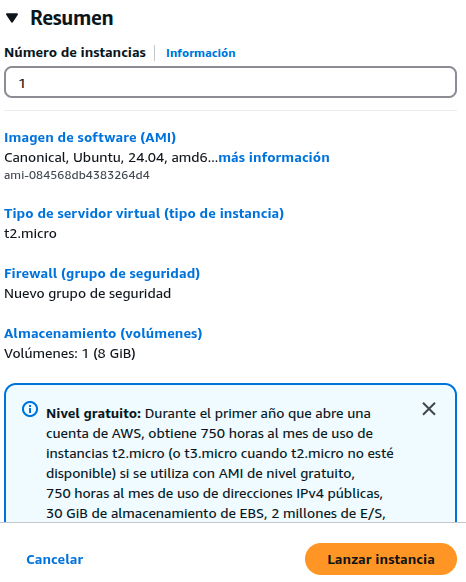

# PROYECTO FINAL DEL CICLO ASIX (Proyecto SIGEI-GLPI)

## 1 - Escenario


## 2 - Estructura Detallada del Escenario AWS con GLPI

### Diagrama de arquitectura


### Tabla de componentes

```bash
| Capa           | Componente   | Versión  | Función                     | Configuración Recomendada                     |
|----------------|--------------|----------|-----------------------------|-----------------------------------------------|
| Infraestructura| AWS EC2      | -        | Hosting de la solución      | t3.medium (2vCPU, 4GB RAM)                    |
| SO             | Ubuntu Server| 22.04 LTS| Base del sistema            | Auto-updates habilitados                      |
| Servidor Web   | Apache       | 2.4.x    | Servir contenido web        | Módulos: rewrite, ssl, headers                |
| Lenguaje       | PHP          | 8.1      | Procesamiento backend       | Extensiones: mysqli, gd, xml, curl, zlib, intl|
| Base de Datos  | MariaDB      | 10.6+    | Almacenamiento de datos GLPI| InnoDB, utf8mb4_unicode_ci                    |
| Aplicación     | GLPI         | 10.x     | Gestión de tickets IT       | Configuración optimizada para 50+ usuarios    |
```

### Usuarios y Permisos

```bash
| Usuario     | Grupo    | Directorios        | Permisos |
|-------------|----------|--------------------|----------|
| www-data    | www-data | /var/www/html/glpi | 750      |
| mysql       | mysql    | /var/lib/mysql     | 700      |
| root        | root     | /etc/glpi          | 600      |
```

### Especificaciones Técnicas Recomendadas

**Requerimientos de Hardware.**

```bash
| Componente     | Mínimo | Recomendado | Producción  |
|----------------|--------|-------------|-------------|
| vCPUs          | 1      | 2           | 4+          |
| RAM            | 2GB    | 4GB         | 8GB+        |
| Almacenamiento | 20GB   | 50GB        | 100GB+ (SSD)|
| IOPS           | 100    | 500         | 1000+       |
```

## 3 - Introducción del proyecto

### 3.1 - Descripción del proyecto

- El presente proyecto tiene por objeto crear una **aplicación web de Código abierto** que permita llevar el **control** de los equipos informáticos de una organización (empresa particular o de mantenimiento, escuela, instituto, ministerios, agencias, etc...) y sobre todo mantener un **historial ordenado** de todo lo que ocurre con el **soporte técnico.**

### 3.2 - Objetivos del proyecto

- Tener un **inventario completo** de los dispositivos tecnológicos de la organización.
- Gestionar **incidencias** o problemas técnicos de manera ordenada.
- Crear **códigos QR** para gestionar puntualmente vía móvil esas incidencias o consultas.*
- **Asignar tareas** a técnicos y hacer **seguimiento** de su resolución.
- Obtener reportes útiles sobre el **estado del sistema** y los equipos.
- Mejorar la **atención al usuario interno** de la empresa.

## 4 - Análisis de opciones y requisitos vistos para considerar

### 4.1 - Snipe-IT


**Snipe-IT** es una **aplicación web de código abierto** diseñada para la **gestión de activos de TI.** Es una solución popular entre empresas y organizaciones que buscan una herramienta flexible y personalizable para rastrear y administrar sus activos de **hardware y software.**

#### 4.1.1 - Enfoque

- Principalmente una herramienta de gestión de activos de TI (**ITAM-gestión de activos de TI**).
- Sobresale en el **seguimiento** de activos de hardware y software, **licencias** e información relacionada.

#### 4.1.2 - Fortalezas

- Interfaz **fácil** de usar.
- Sólidas capacidades de seguimiento de activos.
- Ideal para organizaciones que necesitan un **inventario detallado** de hardware y software.
- Muy bueno en la gestión de licencias.
- Muy bueno en el rastreo de los activos con **códigos de barras y códigos QR.**

#### 4.1.3 - Limitaciones

- Menos robusto en áreas como la mesa de ayuda y la gestión de servicios en comparación con **GLPI.**

### 4.2 - GLPI ( Gestionnaire Libre de Parc Informatique)


Un software **gratuito y open-source** para gestionar activos de TI (**hardware, software**).
GLPI permite **administrar inventarios** de equipos, **seguimiento de problemas** y **gestión de tareas** relacionadas con el **mantenimiento** y soporte de **sistemas informáticos**; o sea atender, ayudar, solucionar y rastrear problemas e incidencias (**tickets**).

#### 4.2.1 - Enfoque

- Una **suite integral** de gestión de servicios de TI (ITSM).
- Incluye **gestión de activos**, **mesa de ayuda** y **funcionalidades** de mesa de servicio.

#### 4.2.2 - Fortalezas

- Centraliza inventarios, incidencias y recursos en una **plataforma web.**
- **Multiplataforma + plugins** (flexible y escalable).
- Fuertes herramientas para el **descubrimiento de redes.**
- Cumplir normas (ITIL, **auditorías de software**).

#### 4.2.3- Limitaciones

- Puede tener una curva de aprendizaje **más pronunciada.**
- La interfaz puede considerarse **menos moderna** que la de **Snipe-IT**

**Snipe-IT es más especializado, se ocupa de el "que" tiene la empresa en cuanto a hardware y software.**

**GLPI es más generalizado, se ocupa de "como" la empresa proporciona los servicios informáticos a sus usuarios.**

## 5 - Decisión: GLPI

### 5.1 - Motivos

- Es una elección **más sólida** que Snipe-IT, ya que ofrece un conjunto completo de **herramientas ITSM**, incluyendo **mesa de ayuda**, gestión de **incidencias, problemas y cambios.**
- En definitiva una mayor capacidad de la aplicación de **crecer** y manejar más amplio volumen de **control de existencias**, o sea más detalle y vigilancia de todo.
- GLPI cuenta con una **comunidad global** de usuarios y desarrolladores que contribuyen a su desarrollo y soporte,esto nos asegura que la herramienta esté en **constante evolución** y que haya **recursos disponibles** para resolver problemas y dudas.
- GLPI es utilizado en todo el mundo, con una **fuerte presencia en Europa y sobre todo en América Latina** donde prácticamente es el dominador en ese mercado.
- Su adaptabilidad a diferentes **idiomas y normativas** es lo que lo hace adecuado para **organizaciones internacionales** que buscan una solución de gestión de IT eficiente y flexible.

## 6 - Herramientas
  
### 6.1 Parte servidor (backend)

#### 6.1.1 - Ubuntu Server


**Sistema operativo que nos proporcionará la base para ejecutar los servicios**

- Es una versión del sistema operativo Ubuntu diseñada específicamente para su uso en **servidores.**
- **No incluye** una interfaz gráfica de usuario (GUI), lo que reduce el consumo de recursos y mejora el rendimiento. En su lugar, se administra principalmente a través de la **línea de comandos.**
- Ofrece una amplia gama de software y herramientas para configurar diversos **servicios de servidor**, como servidores web (**Apache, Nginx**), servidores de bases de datos (**MySQL, Mariadb, PostgreSQL,...**) y servidores de archivos.
- Ubuntu Server se caracteriza por su **estabilidad y seguridad**, lo que lo convierte en una opción confiable para entornos de producción.
- Recibe **actualizaciones de seguridad** periódicas para proteger contra vulnerabilidades.
- Como parte de la familia Ubuntu, Ubuntu Server es de **código abierto**, lo que significa que es **gratuito** y se puede modificar y distribuir libremente.*
  - Usos comunes:
    - Alojar **sitios web** y **aplicaciones web.**
    - Servir **BBDD.**
    - Administrar **redes y servicios de red.**
    - Implementar **servicios en la nube.**
    - **Servidores de archivos.**

#### 6.1.2 - Apache


**Será el servidor web que nos gestionará las solicitudes HTTP y nos proporcionará las páginas web.**

- Apache es un software de **servidor web HTTP** de código **abierto.**
- Esto significa que es responsable de recibir **solicitudes de los navegadores** web y enviar las **páginas web** correspondientes al usuario.
- Es una pieza fundamental de la **infraestructura de Internet**, ya que alimenta una gran parte de los sitios web en línea.
- Su **arquitectura modular** permite extender sus funcionalidades mediante la instalación de **módulos adicionales.** Esto lo hace muy flexible y adaptable a diferentes necesidades.
- Funciona en una amplia variedad de **sistemas operativos**, incluyendo **Linux, Windows y macOS.**
- Apache es conocido por su **fiabilidad y estabilidad**, lo que lo convierte en una opción popular para **sitios web de alto tráfico.**
- Cuenta con una gran **comunidad de usuarios y desarrolladores** que proporcionan soporte y contribuyen a su desarrollo.
- Apache es utilizado por muchos proveedores de **alojamiento web** para alojar sitios web de sus clientes.
- Puede utilizarse como servidor de aplicaciones para alojar aplicaciones **web dinámicas.**
- Apache también puede funcionar como un **servidor proxy**, actuando como intermediario entre los navegadores web y otros servidores.

#### 6.1.3 - MariaDB


**Será la BBDD que nos almacenará los datos de GLPI.**

- **Es un sistema de gestión de BBDD relacionales (RDBMS)** de código **abierto**, las cuales almacenan los datos en **tablas separadas** en lugar de poner todos los datos en un solo sitio.
- MariaDB mantiene alta **compatibilidad con MySQL**, por lo que la mayoría de las aplicaciones que funcionan con MySQL pueden migrar sin cambios.
- Usa el mismo **formato de archivos, protocolos y APIs** (como PHP, Python, Java, etc.).
- Incluye **motores de almacenamiento** optimizados como Aria, XtraDB (en lugar de InnoDB) y ColumnStore para análisis de datos.
- Soporte para **consultas paralelas** y **optimización avanzada.**
- **Nuevas funcionalidades:**
  - **JSON y GIS:** Soporte mejorado para datos JSON y geográficos.
  - **Window Functions:** Funciones analíticas avanzadas (desde MariaDB 10.2).
  - **Temporal Tables:** Tablas que registran cambios históricos.
  - Incluye características como **encriptación** de tablas, **autenticación** con plugins externos (ej. PAM, LDAP) y **roles de usuarios.**
  - Empresas como Google, Wikipedia, Red Hat, Ubuntu (es el RDBMS predeterminado en muchas distribuciones Linux) y Alibaba lo utilizan en producción.

#### 6.1.4 - PHP


**Será el lenguaje de programación que ejecutará el código de GLPI y nos generará las páginas dinámicas.**

- **PHP (Hypertext Preprocessor)** es un lenguaje de programación de código **abierto** especialmente diseñado para el desarrollo web y la creación de sitios dinámicos. Se ejecuta en el servidor **(backend)** y permite interactuar con **BBDD**, generar contenido **dinámico** y manejar sesiones de usuarios.
- El código PHP se ejecuta en el servidor (como **Apache o Nginx**), generando **HTML** que se envía al navegador.
- Similar a **C, Java o Perl**, con **tipado dinámico.**
- Soporte **nativo** para MySQL/MariaDB, PostgreSQL, SQLite, MongoDB y más.
- Funciona en Windows, Linux, macOS y es usado por **CMS** como WordPress, Drupal y Joomla.
- Soporta **programación orientada a objetos** (POO) y tiene miles de librerías (**framework** como Laravel, Symfony).
- Se utiliza para crear páginas web dinámicas (ej.: tiendas online, blogs, foros), desarrollar **APIs** (junto con **JSON o XML**),**automatizar** tareas del servidor (ej.: enviar emails, subir archivos), etc...

#### 6.1.5 - GLPI


**Será la aplicación detallada anteriormente que se instalará en el servidor y que nos gestionará los activos de TI con todos los servicios que nos ofrece.**

#### 6.1.6 - AWS


**La instancia será la MV en la nube que nos alojará todo lo anterior.**

- **AWS, o Amazon Web Services**, es una plataforma de servicios en la **nube** que ofrece una amplia gama de **herramientas y soluciones.** Empresas y desarrolladores usan AWS para **almacenar datos, alojar aplicaciones, crear infraestructura virtual** y mucho más.
- **Computación:** Con Amazon EC2, podemos ejecutar **servidores** virtuales para nuestras aplicaciones.
- **Almacenamiento:** Amazon S3  nos permite guardar grandes cantidades de datos con **alta disponibilidad y seguridad.**
- **BBDD:** Podemos administrarlas con servicios como Amazon RDS.
- **Inteligencia artificial:** AWS tiene herramientas para aprendizaje automático, análisis de datos y procesamiento de lenguaje natural.

**En resumen, el servidor nos manejará toda la lógica, el almacenamiento y la generación de contenido.**

### 6.2 Parte del cliente web (frontend)

#### 6.2.1 - Google Chrome


**Será el navegador WEB que nos interpretará y nos mostrará las páginas generadas por el servidor.**

- Es un **software** que nos permite acceder a Internet y visualizar páginas web.
- Que entre sus principales **funciones** se incluye:
  - **Velocidad:** Chrome es conocido por su velocidad y eficiencia, lo que permite cargar páginas web rápidamente.
  - **Simplicidad:** Tiene una interfaz de usuario sencilla y fácil de usar.
  - **Seguridad:** Chrome incluye funciones de seguridad integradas para proteger a los usuarios de malware y sitios web peligrosos.
  - **Sincronización:** Permite sincronizar marcadores, historial y contraseñas entre diferentes dispositivos.
  - **Extensiones:** Ofrece una amplia variedad de extensiones que permiten personalizar y ampliar la funcionalidad del navegador.
  - **Integración con servicios de Google:** Se integra perfectamente con otros servicios de Google, como la Búsqueda de Google, GMail y YouTube.
  - **Multiplataforma:** Está disponible para múltiples sistemas operativos, incluyendo Windows, macOS, Linux, Android e iOS.

#### 6.2.2 - La interfaz de GLPI


**Es la que el usuario ve, maneja y toca todo lo relacionado con la experiencia de usuario.**

- La interfaz de GLPI **realiza** lo siguiente:
  - **Muestra la UI:** Renderiza menús, formularios y datos (HTML/CSS generados por PHP).
  - **Gestiona interacciones:** Validaciones, clics y peticiones.
  - **Se comunica con el backend:** Envía/recibe datos al servidor PHP.

**En resumen el cliente: Interfaz visual + acciones del usuario.**

### 6.3 - Recursos para la documentación

#### 6.3.1 - Visual Studio Code (VS Code)


**Editor de código fuente desarrollado por Microsoft, ligero, rápido y muy personalizable que utilizaremos para ajustar el documento del proyecto.**

- **Características principales:**
  - Sirve para **escribir código** en muchos lenguajes.
  - **Gratis y de código abierto.**
  - Funciona en **Windows, macOS y Linux.**
  - Tiene **extensiones** para añadir funciones extra (por ejemplo, ayuda para depurar código, colorear la sintaxis, conectar con Git, etc.).
  - **Autocompletado** inteligente con inteligencia artificial (como Copilot).
  - Integración con **terminal, control de versiones (Git) y depuración.**
  
**VS Code nos ayuda en un rompecabezas (valga la expresión) a organizar nuestras piezas, nos da ideas de cómo unirlas y nos avisa si algo no encaja bien.**

#### 6.3.2 - Markdown


**Markdown es un lenguaje de marcado ligero que nos permite dar formato a texto plano de manera sencilla, donde los cambios de formato se ven inmediatamente, Markdown utiliza una sintaxis simple para indicar cómo debe formatearse el texto sin usar botones ni menús.**

**Será el lenguaje que utilizaremos para describir el proyecto.**

- **Características clave:**
  - **Sencillez:**
    - Su sintaxis es fácil de aprender y recordar, lo que permite escribir documentos formateados rápidamente.
  - **Legibilidad:**
    - Los archivos Markdown son legibles incluso en su forma de texto plano, sin necesidad de renderizarlos.
  - **Portabilidad:**
    - Los archivos Markdown se pueden abrir y editar en cualquier editor de texto, lo que los hace independientes de plataformas y software específicos.
  - **Versatilidad:**
    - Markdown se puede utilizar para crear una variedad de documentos, desde simples notas hasta documentación técnica y páginas web.
  - **Compatibilidad:**
    - Muchos sitios web y aplicaciones, como GitHub, Reddit y Slack, admiten Markdown.

**Markdown es una forma fácil y rápida de escribir texto con formato (como títulos, negritas, listas o enlaces) usando solo el teclado, sin menús ni botones.**

**6.3.3 - Tex Live.**


**TeX Live es un conjunto de programas para escribir y compilar informes en LaTeX que es además un sistema para crear documentos muy bien presentados.**

**Será el compilador para generar nuestro documento PDF del proyecto.**

- **Características:**
  - **LaTeX** será el lenguaje especial que escribirá y transformará nuestro documento en uno mejor visualmente.
  - **TeX Live** es la **caja de herramientas** que necesitamos para que LaTeX funcione en nuestro ordenador.

**Nos incluye:**

- **LuaLaTeX:** Es una variante de **LaTeX** que utiliza **LuaTeX** como su **motor de procesamiento** en lugar de pdfTeX o XeTeX.

    Permite una mayor flexibilidad y personalización, ya que incluye el lenguaje de programación **Lua**, lo que permite a los usuarios extender las capacidades de LaTeX mediante scripts y configuraciones avanzadas.

    Es especialmente útil para quienes necesitan funcionalidades adicionales como manipulación de **fuentes o gráficos personalizados**.

**Tex Live es un sistema de Tipografía para Documentación PDF.**

#### 6.3.4 - Pandoc


**Pandoc es una herramienta de software libre y de código abierto que se utiliza para convertir documentos de un formato a otro. Se le conoce como el "convertidor universal de documentos" debido a su amplia capacidad para manejar una gran variedad de formatos de entrada y salida y por tanto será el conversor que utilizaré para trasformar el documento del proyecto de Markdown a PDF.**

- **Extremadamente útil** para tareas como la **creación de libros electrónicos**, la **generación de informes**, la **conversión de documentos web** a otros formatos, y mucho más.
- Es muy flexible y permite **personalizar** la salida de diversas maneras, incluyendo la **modificación de estilos**, la **inclusión de metadatos**, y la **manipulación de la estructura** del documento.
- Muy útil para la creación de **documentos académicos**, ya que se integra con **gestores de referencias bibliográficas**.

#### 6.3.5 - Eisvogel


**Herramienta que mejora la presentación de documentos convertidos desde markdown a pdf, por tanto será la plantilla que nos facilitará la mejora de calidad en la creación del documento final de nuestro proyecto.**

- Es una **plantilla de LaTeX para Pandoc**, diseñada específicamente para crear documentos **PDF** con una apariencia **profesional y elegante**.
- Muy popular para generar **informes, presentaciones** y otros **documentos técnicos** a partir de archivos **Markdown**.
- Gran cantidad de opciones de **personalización**, incluyendo la posibilidad de cambiar los **colores**, las **fuentes** y el **diseño** del documento.
- Facilita la creación de documentos LaTeX de **alta calidad** a partir de archivos Markdown, simplificando el proceso de **publicación**.

### 6.4 - Publicación y Alojamiento de la Documentación en la Web

**6.4.1 - MkDocs.**


**Es un generador rápido de páginas web estáticas orientado a la creación de documentación de proyectos.**

**Será nuestro sitio HTML en donde se alojará nuestra documentación del proyecto.**

- Los archivos fuente de documentación se escriben en **Markdown** y se configuran con un solo archivo de configuración **YAML**, que es un formato de serialización de datos legible por humanos inspirado en lenguajes como XML, C, Python o Perl.

- Con **MkDocs** podemos crear sitios HTML estáticos que se pueden alojar en páginas **GitHub** o en cualquier otro lugar que elijamos. En nuestro caso lo haremos en **GitHub.**

- Existen infinidad de **temas o plantillas** disponibles para MkDocs que podemos elegir de entre los integrados, seleccionar alguno de los que se citan en la wiki [MkDocs Themes](https://github.com/mkdocs/mkdocs/wiki/MkDocs-Themes) o crear el nuestro propio con [Material for MkDocs](https://squidfunk.github.io/mkdocs-material/).

- Una de las grandes ventajas que nos ofrece MkDocs es la de obtener una **vista previa** de nuestro sitio mientras trabajamos. Esto se consigue mediante el **servidor de desarrollo** incorporado que incluso recargará y actualizará automáticamente nuestro navegador cada vez que guardemos los cambios.

- MkDocs es fácil de **personalizar** por lo que permite obtener la documentación de nuestro proyecto tal como lo deseamos personalizando el tema y/o instalando algunos complementos

**Combina simplicidad con flexibilidad, permitiéndonos personalizar el diseño con temas y complementos.**

**6.4.2 - GitHub.**


**GitHub es una plataforma en línea diseñada para el desarrollo y la colaboración de software. Es el lugar donde desarrolladores y equipos pueden almacenar, compartir y trabajar juntos en proyectos.**

**En nuestro caso será la plataforma que alojará nuestro documento del proyecto, para una posterior visualización.**

- Esto permite realizar un **seguimiento** de los cambios en el código a lo **largo del tiempo** y facilita la **colaboración** en proyectos, ya que varias personas pueden trabajar en el mismo código **simultáneamente.**

- En GitHub, **podemos:**

  - **Alojar repositorios:** Guardar tus proyectos de código en un lugar centralizado.

  - **Colaborar:** Trabajar con otros desarrolladores, proponiendo y revisando cambios a través de "pull requests".

  - **Control de versiones:** Ver el historial de cambios, quién los hizo y por qué.
  - **Automatizar tareas:** Usar "GitHub Actions" para automatizar pruebas, despliegues y más.
  - **Publicar sitios web:** Utilizar **GitHub Pages** para alojar sitios web estáticos directamente desde tus repositorios.

**Es una herramienta que fomenta la transparencia, la organización y la colaboración.**

## 7 - Instalación y configuración de las herramientas a utilizar

### 7.1 - AWS con Ubuntu Server 24.04

 

#### Creación de una instancia EC2 en AWS

- **Paso 1. Iniciamos el laboratorio.**

  - Desde el curso de AWS Academy iniciamos el laboratorio pulsando en Start Lab y esperamos a que el icono que aparece junto al texto de AWS se ponga de **color verde**.


- **Paso 2.Accedemos a la consola de Administración de AWS.**
  - Desde la consola seleccionamos el servicio de **EC2**.


- **Paso 3. Buscamos el botón "Launch Instance" para crear una instancia EC2.**


- **Paso 4. Le asignamos un nombre a la instancia EC2 que vamos a crear.**


- **Paso 5. Seleccionamos la AMI y la arquitectura de la instancia EC2.**
  - En este paso tenemos que seleccionar la **AMI** (Amazon Machine Image) y la arquitectura. Para mi proyecto voy a seleccionar la imagen **Ubuntu Server 24.04 LTS (HVM), SSD Volume Type**, y la **arquitectura 64 bits (x86).**


- **Paso 6. Seleccionamos el tipo de instancia EC2.**
  - Seleccionamos que vamos a crear una instancia de tipo **t2.micro.** que cuenta con 1 vCPU y 1 GiB de RAM.


- **Paso 7. Seleccionamos la clave pública SSH que le vamos a inyectar a la instancia EC2.**

  - En este ejemplo vamos a utilizar la clave pública **vockey** que está asociada a nuestra cuenta de usuario en la plataforma AWS Learner Lab. La clave privada la descargaremos más adelante desde la plataforma, para poder conectarnos por SSH con la instancia EC2.


- **Paso 8. Configuramos los grupos de seguridad.**
- En este proyecto vamos a crear un nuevo grupo de seguridad y vamos a utilizar tres reglas para permitir tráfico **SSH, HTTP y HTTPS.**
  - SSH. Protocolo: TCP. Puerto: 22. Origen: 0.0.0.0/0
  - HTTP. Protocolo: TCP. Puerto: 80. Origen: 0.0.0.0/0
  - HTTPS. Protocolo: TCP. Puerto: 443. Origen: 0.0.0.0/0


- **Paso 9. Añadimos el almacenamiento que utilizará la instancia.***
  - En este paso configuramos cuál será el almacenamiento que utilizará la instancia EC2 que estamos creando.
  - Para nuestro ejemplo en el proyecto no vamos a modificar ninguno de los parámetros que aparecen por defecto y utilizaremos un disco SSD de 8 GB.


- **Paso 10. Revisamos la configuración seleccionada.**
  - Para crear la instancia pinchamos sobre el botón **Lanuch Instance.**



- **Paso 11. Estado de la instancia.**
  - En este paso nos aparece un mensaje indicando que la instancia se está creando.
    **Pincharemos sobre el identificador de la instancia que aparece en el cuadro de color verde.**


- **Paso 12. Consultaremos el estado de la instancia desde la consola de administración.**
  - Cuando pasen unos segundos le aparecerá en la consola la instancia que acaba de crear.
  - Cuando la instancia muestre que está en estado **Running** es que está preparada para
conectarnos a ella.


#### Nos conectamos a la instancia por SSH para ejecutar los comandos de instalación de las herramientas del proyecto

- **Paso 1. Seleccionamos la instancia y pinchamos sobre "Conectar".**


- **Paso 2. Vamos a obtener el comando para conectarnos desde un cliente SSH en Linux.**
  - En este paso nos aparece cómo podemos conectarnos a la instancia que acabamos de crear.
  - Seleccionaremos la opción **SSH client**, y veremos los pasos que tenemos que realizar para conectarnos a la instancia.
  - El comando que tenemos que utilizar para conectarnos a la instancia lo podemos copiar en este paso. En el comando aparece el nombre del archivo **.pem** de la clave privada (que hemos creado), el nombre del usuario y el nombre DNS público de la instancia.


- En nuestro caso al **crear par de claves** ya las hemos ubicado en el directorio **Música**, pero se pueden descargar pinchando sobe el texto **AWS Details** y le aparecerá en la parte derecha la posibilidad de descargar la clave como un archivo**.PEM o .PPK.**

- En Linux utilizaremos la clave **.PEM**, cuando descarguemos la clave se descargará como **nombre.pem o nombre.ppk.**


**Paso 3. Nos conectamos por SSH desde Linux.**

- Cambiamos los permisos del archivo para que solo el propietario tenga permisos de lectura.

```bash
  sudo chmod 400 clave_aws.pem
```

- Ejecutamos el comando que copiamos en el **paso 2** para conectarnos por SSH a la instancia EC2 desde un terminal de Linux.
- El comando será parecido al este, pero el nombre DNS de la instancia será diferente.

```bash
  sudo ssh -i "clave_AWS.pem" ubuntu@ec2-34-239-105-173.compute-1.amazonaws.com
```


### 7.2 - Creación de la pila LAMP (Linux, Apache, MariaDB y PHP)

#### 7.2.1 - Instalación de Apache


- **Paso 1. Instalamos:**

    ```bash
    sudo apt update
    sudo apt install apache2 -y
    ```

- **Paso 2. Realizamos un backup de nuestro 000-defaults.conf**

    ```bash
    sudo mv /etc/apache2/sites-available/000-default.conf /etc/apache2/sites-available/000-default.conf.bkp
    ```

- **Paso 3. Creamos un archivo de configuración (glpi.conf) para el sitio de GLPI en Apache como nos indica la "Documentación Oficial de GLPI".**

    <https://glpi-install.readthedocs.io/en/latest/prerequisites.html#web-server>

**GLPI recomienda no colocarlo en el directorio por default de Apache "/var/www/html", sugiere colocarlo por fuera por lo cual lo colocaremos en "/var/www".**

`sudo nano /etc/apache2/sites-available/glpi.conf`

```bash
<VirtualHost *:80>
    ServerName edu.com
    DocumentRoot /var/www/glpi/public

    <Directory /var/www/glpi/public>
        Options -Indexes +FollowSymLinks
        AllowOverride All
        Require all granted
        RewriteEngine On
        # Redirect all requests to GLPI router, unless file exists.
        RewriteCond %{REQUEST_FILENAME} !-f
        RewriteRule ^(.*)$ index.php [QSA,L]
    </Directory>

    ErrorLog ${APACHE_LOG_DIR}/glpi-error.log
    CustomLog ${APACHE_LOG_DIR}/glpi-access.log combined

</VirtualHost>    
```

- **Paso 4. Habilitamos el archivo .conf que hemos creado y habilitamos el modulo rewrite.**

    ```bash
    sudo a2ensite glpi.conf
    sudo a2enmod rewrite
    ```

- **Paso 5. Recargamos, activamos y reiniciamos apache2.service**

    ```bash
    sudo systemctl reload apache2.service
    sudo systemctl enable apache2.service
    sudo systemctl restart apache2.service
    ```

#### 7.2.2 - Instalación de PHP


- **Paso 1. Instalaremos los repositorios de php y actualizaremos.**

    ```bash
    sudo apt install software-properties-common apt-transport-https -y
    sudo add-apt-repository ppa:ondrej/php -y
    sudo apt update
    ```

- **Paso 2. Instalamos la versión de php que nos indica la "Documentación Oficial de GLPI", los paquetes necesarios y reiniciamos.**

    <https://glpi-install.readthedocs.io/en/latest/prerequisites.html#php>

    

    ```bash
    sudo apt install php8.3 php8.3-cli php8.3-common libapache2-mod-php8.3 -y
    sudo apt install libapache2-mod-fcgid php8.3-fpm -y
    sudo systemctl restart apache2.service
    ```

- **Paso 3. Activamos variable "session.cookie_httponly" a "on" en "/etc/php/8.3/fpm/php.ini" y reiniciamos.**

    ```bash
    sudo nano /etc/php/8.3/fpm/php.ini
    ```

    Buscamos con el editor la variable **session.cookie =** y la activamos con **on**.

    Es una medida de seguridad importante para **proteger las sesiones de usuario** en aplicaciones web PHP.

    Ayuda a prevenir el **robo de cookies y la suplantación de identidad.** Se recomienda **habilitar** esta directiva en todos los entornos de producción.

    ```bash
    sudo systemctl restart php8.3-fpm
    ```

- **Paso 4. Habilitamos funciones instaladas de php, habilitamos la función "fpm" y recargamos-reiniciamos**

    ```bash
    sudo a2enmod proxy_fcgi setenvif
    sudo a2enconf php8.3 -fpm
    sudo systemctl reload apache2.service
    sudo systemctl restart apache2.service
    ```

**Instalamos la extensiones y dependencias que vamos a necesitar para la posterior instalación de "GLPI".**

```bash
sudo apt install -y php8.3-{curl,gd,imagick,intl,apcu memcache,imap,mysqli,ldap,tidy,xmlrpc,pspell,gettext,mbstring,fpm,iconv,xml,xsl,bz2,Phar,zip,exif}
```

#### 7.2.3 - Instalación de MariaDB


- **Paso 1.Instalamos mariadb-server y securizamos.**

    Seguimos los pasos, colocamos una nueva contraseña para el usuario **root** de la BBDD, eliminamos las BBDD de prueba y eliminamos el acceso a usuarios anónimos **(Enter--n--y--Enter-pass--Re-enter-pass--y--y--y--y).**

    ```bash
    sudo apt install mariadb-server -y
    sudo mysql_secure_installation
    ```

- **Paso 2. Creamos una BBDD en nuestro caso "glpi", un usuario para GLPI en MariaDB, damos privilegios y además activaremos la zona horaria en mysql.**

    Podemos cambiar los datos que deseemos, **nombre de  usuario y BBDD**, y colocaremos una contraseña apropiada.

    ```bash
    sudo mysql -u root -p
    CREATE DATABASE glpi; 
    CREATE USER '<nomuser>'@'%' IDENTIFIED BY <'passuser'>;
    GRANT ALL PRIVILEGES ON glpi.* TO '<nomuser>'@'%';
    GRANT SELECT ON mysql.time_zone_name TO '<nomuser>'@'%';
    flush privileges;
    exit;
    ```

- **Paso 3. Cargamos las zonas horarias del sistema (introducimos la contraseña de root).**

    ```bash
    sudo mysql_tzinfo_to_sql /usr/share/zoneinfo | sudo mysql -u root -p mysql
    ```

#### Descarga e instalación de GLPI

{ width=15% }

- **Paso 1. Procederemos desde su sitio oficial, la última versión para la fecha es la "10.0.18".**

    <https://glpi-project.org/es/descargar-software/>

    ```bash
    wget https://github.com/glpi-project/glpi/releases/download/10.0.18/glpi-10.0.18.tgz
    ```

- **Paso 2. Descomprimimos el archivo y lo movemos (-C) al directorio "/var/www"**
    Posteriormente eliminaremos el fichero **.tgz**, que no lo necesitaremos y el **index.html** para no tener problemas.

    ```bash
    sudo tar -zxvf glpi-10.0.18.tgz -C /var/www/
    sudo rm -rf glpi-10.0.18.tgz 
    sudo rm -rf /var/www/html/index.html
    ```

- **Paso 3. Le damos al usuario de apache la propiedad de la carpeta y permisos.**

    ```bash
    sudo chown -R www-data:www-data /var/www/glpi
    sudo chmod -R 755 /var/www/glpi
    ```

- **Paso 4 (opcional). Si queremos cambiar los logotipos de GLPI, tendremos que tener en el $HOME de nuestro servidor el logo-master que cambiará los de la aplicación.**

    Una vez consultada la **página oficial** de las recomendaciones para determinar el tamaño **(pixel)** de los logos de cada sitio, procederemos a crearlos.
  
    <https://glpi-plugins.readthedocs.io/en/latest/branding/index.html>

    Tendremos que tener instalado en el sistema **imagemagick** para poder crear con el comando **converter** los ficheros de imagen de los logos con los tamaños que se nos indica.

    `sudo apt install imagemagick -y`

    Haremos un **backup de los logos originales** de la aplicación.

    ```bash
    sudo mv /var/www/glpi/pics/favicon.ico /var/www/glpi/pics/favicon.ico.bkp
    sudo mv /var/www/glpi/pics/logos/logo-GLPI-100-white.png /var/www/glpi/pics/logos/logo-GLPI-100-white.png.bkp
    sudo mv /var/www/glpi/pics/logos/logo-GLPI-250-black.png /var/www/glpi/pics/logos/logo-GLPI-250-black.png.bkp
    ```

    Crearemos los **ficheros de imagen** de los logos con los **tamaños requeridos (pixeles)** que vamos a necesitar.

    ```bash
    sudo convert $HOME/<logo-master> -resize 32x32\! favicon.ico
    sudo convert $HOME/<logo-master> -resize 100x55\! logo-GLPI-100-white.png
    sudo convert $HOME/<logo-master> -resize 220x130\! logo-GLPI-250-black.png
    ```

    Cambiamos los **permisos** de los ficheros creados a **755.**

    ```bash
    sudo chmod 755 favicon.ico
    sudo chmod 755 logo-GLPI-100-white.png
    sudo chmod 755 logo-GLPI-250-black.png
    ```

    Copiamos los ficheros de imagen creados de los logos a sus **respectivas rutas.**

    ```bash
    sudo cp favicon.ico /var/www/glpi/pics/
    sudo cp logo-GLPI-100-white.png /var/www/glpi/pics/logos/
    sudo cp logo-GLPI-250-black.png /var/www/glpi/pics/logos/
    ```

    Cambiamos el propietario y el grupo de todos los ficheros a **www-data.**

    ```bash
    sudo chown www-data:www-data /var/www/glpi/pics/favicon.ico
    sudo chown www-data:www-data /var/www/glpi/pics/favicon.ico.bkp
    sudo chown www-data:www-data /var/www/glpi/pics/logos/logo-GLPI-100-white.png
    sudo chown www-data:www-data /var/www/glpi/pics/logos/logo-GLPI-100-white.png.bkp
    sudo chown www-data:www-data /var/www/glpi/pics/logos/logo-GLPI-250-black.png
    sudo chown www-data:www-data /var/www/glpi/pics/logos/logo-GLPI-250-black.png.bkp
    ```

**HAY QUE TENER EN CUENTA QUE PARA QUE SE APLIQUE EN SU MOMENTO EL CAMBIO DE LOS LOGOS TENDREMOS QUE "ELIMINAR-BORRAR LOS DATOS DEL NAVEGADOR".**

En este momento ya tenemos instalados todos los componentes para ejecutar GLPI abriendo un navegador contra nuestro GLPI, <<http://IP> de nuestro servidor

Si todo ha ido bien tendremos el **asistente de configuración de GLPI**, el cual detallaremos más adelante en un apartado concreto.

### 7.3 - Instalación automatizada de todo este proceso

Para una instalación más **rápida y optimizada** de todo el proceso realizado en los puntos **7.2 y 7.3** y para configurar **automáticamente** algunas funcionalidades clave, podemos utilizar un script.

Puedes ver el script [aquí](./GLPI_script.md)

[Descargar el archivo](./GLPI_script.sh)

### 7.4 - Descarga e instalación de Visual Studio Code


- **Paso 1. Desde la web oficial descargaremos el paquete que corresponda con nuestro SO.**

    <https://code.visualstudio.com/download>

- **Paso 2. Ejecutaremos el instalador "desde el directorio en el cual lo hemos descargado" y seguiremos las instrucciones de éste, lo cual veremos detalladamente en un apartado aparte para este cometido.**

### 7.5 - Instalación de las extensiones en VScode para Markdown


- **Paso 1. Buscaremos e instalaremos las  extensiones desde la barra lateral izquierda, haciendo clic en el icono de Extensiones.**

    

- **Paso 2. Instalaremos las extensiones esenciales para trabajar con markdown.**

    - **Markdown All in One:**

        

        - Ofrece funciones como vista previa, atajos de teclado, autocompletado, lista de contenidos, y mucho más.

        - Muy útil para quienes trabajan extensamente con documentos Markdown.

    - ***Markdown Preview Enhanced:***

        

        - Esta extensión amplía la vista previa estándar de Markdown de VS Code.

        - Permite previsualizar diagramas, fórmulas matemáticas, archivos PDF, y otros elementos avanzados.

        - Es ideal para documentos Markdown complejos.
  
### 7.6 - Instalación de Tex Live


Instalaremos la distribución de la **versión completa** que contiene todas las herramientas, ya que necesitamos **lualatex** como **motor** de procesamiento.

```bash
sudo apt update
sudo apt install texlive-full
```

### 7.7 - Instalación de Pandoc


Es el **conversor** principal que transforma **Markdown en PDF.**

`sudo apt install pandoc -y`

### 7.8 - Instalación de la plantilla Eisvogel


- **Paso 1. Descargaremos la última versión de la plantilla desde web "SOURCEFORGE".**

    <https://sourceforge.net/projects/eisvogel.mirror/>

    ```bash
    wget https://sourceforge.net/projects/eisvogel.mirror/files/latest/download
    ```

- **Paso 2. Descomprimimos la carpeta.**

    Posteriormente eliminaremos el fichero **.zip**, que no lo necesitaremos.

    ```bash
    sudo unzip Eisvogel-<version>.zip
    sudo rm -rf Eisvogel-<version>.zip
    ```

- **Paso 3. Copiamos el fichero "eisvogel.latex" dentro del directorio donde se encuentre nuestro documento .md.**

    ```bash
    sudo cp Eisvogel-<version>/eisvogel.latex /ruta al directorio del fichero .md
    ```

- **Paso 4. El comando para convertir-compilar el archivo.md  en un archivo.pdf bonito usando Pandoc y LaTex.**

    ```bash
    pandoc archivo.md -o archivo.pdf \
      --from markdown \
      --template eisvogel.latex \
      --pdf-engine=lualatex \
      --listings \
      --toc \
      --toc-depth=4
    ```

    - **from markdown**: el archivo está en formato Markdown.

    - **template eisvogel.latex**: usa la plantilla llamada eisvogel para que quede bonito.
    - **pdf-engine=lualatex**: usa el motor LaTeX llamado lualatex para generar el PDF.
    - **listings**: mejora cómo se ve el código (usa el paquete listings de LaTeX).
    - **toc**: añade una tabla de contenido (índice).
    - **toc-depth=4**: el índice puede mostrar hasta 4 niveles de títulos.

**Para configurar automáticamente de una manera más rápida, podemos utilizar el script.**

Puedes ver el script [aquí](./mdpdf%20.md)

[Descargar el archivo](./mdpdf.sh)

### 7.9 - Instalación de MkDocs


- **Paso 1. Instalamos Python.**

    **MkDocs** está hecho en Python, así es que lo necesitamos.

    ```bash
    sudo apt update
    sudo apt install python3 python3-pip
    ```

- **Paso 2. Instalamos MkDocs con pip.**

    `sudo pip3 install mkdocs`

- **Paso 3. Instalar "material".**

    `sudo pip3 install mkdocs-material`

- **Paso 4. Creamos un proyecto en Mkdocs.**

  ```text
  mkdocs new mi-documentacion
  cd mi-documentacion
  ```

- **Esto nos crea una estructura como esta:**

  

- **Paso 5. Añadimos el contenido de .md propio, ejemplo:(docs/Proyecto.md).**

  ```text
  # Proyecto
    - Paso 1
    - Paso 2
  ```  

- **Paso 6. Luego en nuestro "mkdocs.yml" añadiremos.**

  ```mkdocs
  site-name: Mi documentación
  theme:
    name: material
  nav:
    - Inicio: index.md
    - Tutorial: Proyecto.md 
    ```

- **Paso 7 . Si queremos ver el sitio localmente.**

  `mkdocs serve`

  Abriremos nuestro navegador en <http://127.0.0.1:8000>

- **Paso 8. Publicar con GitHub Pages (después de haberlo subido a GitHub)**

  `mkdocs gh-deploy`

  Esto nos generará una carpeta **site/** la cual sube al repositorio en una rama especial llamada **gh-pages**

  

### 7.10 - Instalación de Git


- **Paso 1. Instalamos Git.**

    ```bash
    sudo apt update
    sudo apt install git
    ```

- **Paso 2. Configuraremos Git por primera vez (nuestro nombre y correo).**

    ```bash
    git config --global user.name "Edu Yo"
    git config --global user.email "edu@edu.com"
    ```

- **Paso 3. Crearemos una cuenta de GitHub (si no la tenemos).**

  - Vamos a : <https://github.com/> y creamos ua cuenta.

    

- **Paso 4. Creamos un repositorio en GitHub desde la web.**

    

- **Paso 5. Generamos un nuevo token.**

    

- **Paso 6. Clonamos el repositorio desde el terminal.**

    

    `git clone https://github.com/eduherjul/proyecto-GLPI.git`

    

Cada vez que subamos cambios, nos pedirá **usuario y contraseña** (o **token** si usamos 2FA).

## 8 - Asistente de configuración de GLPI

- **Paso 1.** Si todo ha ido bien tendremos el asistente de configuración de GLPI, después de abrir ya un navegador contra nuestro GLPI, algo como **http://DIRECCION_IP del servidor**, lo primero, escogeremos el idioma a utilizar **& OK**.

- **Paso 2.** Leemos y aceptamos los términos de la licencia de GLPI & **Continuar**.

     

- **Paso 3.** Pulsamos en **Instalar** ya que estamos instalándolo por primera vez.

    

- **Paso 4.** Verificamos que cumplimos todos los requisitos y están todos correctos.

     

- **Paso 5.** Indicamos los datos del servidor de BBDD, indicamos **localhost o 127.0.0.1** e indicamos el **usuario y contraseña** de acceso a la BD **& Continuar**.

- **Paso 6.** Seleccionamos la BD que creamos anteriormente, llamada **glpi & Continuar**.

     

- **Paso 7.** Si conectó e inicializó la BBDD, pulsamos en **Continuar**.

- **Paso 8.** Podemos voluntariamente si queremos enviar las métricas de uso para que la comunidad de GLPI pueda mejorar el producto, en mi caso como son pruebas **desactivaré & Continuar**.

     

     

**Nos indica que existen unas cuentas de usuario ya predefinidas con distintos roles, desactivaremos en un futuro las cuentas y cambiaremos su contraseña. Estas cuentas serían:**

- **Administrador:** glpi-glpi

- **Técnico:** tech-tech

- **Cuenta sólo lectura:** post-only-postonly

- **Cuenta normal:** normal-normal

Inicialmente **Acceso y Contraseña** serán **glpi**

 

## 9 - Documentación funcional de GLPI

### 9.1 - Crear usuarios

**Un usuario es una persona que va a usar GLPI. Puede ser:**

- Un técnico de soporte.

- Un administrativo que genera tickets.

- Un responsable que autoriza compras.

- O simplemente alguien que reporta incidencias.

**Opcional pero recomendable:**

- Seleccionar la **entidad** a la que pertenece.

- Darle un **perfil** (rol):

    - Por ejemplo: "Self-Service", "Técnico", "Administrador".

    

    

### 9.2 - Gestión de perfiles

**Un perfil define lo que el usuario puede hacer y ver. Es como un “rol” o “permiso”.**

Algunos ejemplos que vienen por defecto:

- **Self-Service:** Solo reporta tickets y ve los suyos.
- **Technician:** Ve y gestiona tickets asignados.
- **Supervisor:** Ve todos los tickets de su grupo.
- **Admin:** Tiene acceso completo.
- **Read-Only:** Solo puede ver, no tocar nada.

Podemos crear **perfiles personalizados,** por ejemplo:

- *Un perfil que solo puede ver inventario.*
- *Otro que solo puede aprobar compras, etc...*


- *Le asignamos dentro de cada **apartado** los **permisos** que deseamos para cada perfil o como hemos dicho anteriormente **creamos** un perfil con **permisos personalizados.**


### 9.3 - Generación de códigos QR

Los **códigos QR** se generan para **almacenar y compartir información** de manera **rápida y accesible**.

Su uso es muy amplio y en nuestro proyecto **incluirá:**

- **Enlace al sitio web:** Nos facilitará el acceso a las páginas específicas sin necesidad de escribir la URL.

- **Información de los equipos:** Nos proporcionará detalles adicionales de cada equipo.

- **Fichero de Imagen.png:** Para guardar en la ficha del equipo inventariado y para adjuntar a fichero de texto para su posterior impresion y etiquetado de este.

En nuestro proyecto añadiremos una **extensión** a nuestro navegador **Google-Chrome** desde la **Web Store** de éste, en nuestro caso será:

 

- **Características principales:**

- Genera códigos QR a partir de texto libre y URLs al instante.
- Genera un código QR para tu página actual con un solo clic.
- Personalización de color y tamaño.
- Opción para descargar el código QR como una imagen (PNG/SVG/Código SVG).

Una vez posicionados en el registro de nuestro dispositivo-equipo, haremos un **click** en la **barra superior** del navegador en el **icono** de nuestra extension.

- Se nos abrirá la imagen de un código **QR** para poderlo descargar y guardar.


- A continuación se nos abrirá un **destino dentro de nuestros directorios** para poder elegir una **ubicación o una estructura** que para tal motivo tengamos creada y **guardándolo** para después **imprimirlo.**

### 9.4 - Crear peticiones (incidencias)

Desde la **ficha del usuario** nos seleccionamos **Peticiones creadas >> "Nueva petición** para este elemento".


Aquí ya detallaremos el **tipo, categoría, estado, urgencia, etc...,** que una vez añadida se nos plasmará en el **panel** central.


## 10 - Impresión de códigos QR y almacenamiento de éste en la BBDD

### 10.1 - Almacenamiento de la imagen QR del dispositivo-equipo en la ficha de éste

En la **ficha o registro del activo del elemento seleccionado**, escogemos en la **barra lateral izquierda** la pestaña **Documentos.**


Añadimos un **archivo nuevo**, en nuestro caso una imagen.


### 10.2 - Impresión

Después de tener **almacenados en nuestra estructura de directorios creados para tal efecto los QR**, iremos seleccionando **uno a uno** y transportándolos a una hoja de texto **.odt o .docx** para ubicarlos en una **tabla** creada a tal efecto para su posterior **impresión en tamaño A4.**


## 11 - Migración de la aplicación GLPI desde AWS a Proxmox

### 11.1 - Detalle del proceso

- **Paso 1 - Hacer backup de la BBDD de GLPI (MariaDB) al $HOME.**

    `mysqldump -u root -p glpi > $HOME/glpi_backup.sql`

- **Paso 2 - Comprimir los archivos de GLPI.**

    `sudo tar -czvf $HOME/glpi_files.tar.gz /var/www/glpi`

- **Paso 3 - Copiar los archivos desde el \$HOME de AWS al directorio (Ejem:$HOME) donde se encuentra la clave_AWS.pem del HOST.**

    Esta operación la haremos desde el **HOST.**

    ```bash
    scp -i $HOME/clave_WS.pem ubuntu@ec2-3-86-189-107.compute-1.amazonaws.com:/home/ubuntu/glpi_backup.sql ./
    scp -i $HOME/clave_AWS.pem ubuntu@ec2-3-86-189-107.compute-1.amazonaws.com:/$HOME/glpi_files.tar.gz ./
    ```

- **Paso 4 - Creamos una MV de "Ubuntu Server" con una "ISO" dentro de "Proxmox".**

- **Paso 5 - Copiamos los archivos desde el \$HOME del HOST al $HOME de Ubuntu Server.**

    `sudo scp glpi_backup.sql glpi_files.tar.gz $USER@IP_ubuntu_SRV:./`

- **Paso 6 - Ejecutar todo el punto 7.2 que detallamos anteriormente**

    Tendremos en cuenta al **crear** el usuario para la **BBDD** que sea **el mismo usuario** que el de la **BBDD que exportamos.**

- **Paso 7 - Restauramos la BBDD.**

    `mysql -u <user> -p glpi < "$HOME"/glpi_backup.sql`

- **Paso 8 - Descomprimimos los archivos de glpi.**

    Como el archivo descomprimido ya incluye la estructura **/var/www/**, usamos, **--strip-components=2** que elimina los **2 primeros niveles** de directorio **(var/ y www/)** al descomprimir.

    ```bash
    sudo tar --strip-components=2 -xzvf "$HOME"/glpi_files.tar.gz -C /var/www/
    sudo tar -xzvf "$HOME"/glpi_files.tar.gz -C /var/www/
    sudo rm -rf "$HOME"/glpi_files.tar.gz
    sudo rm -rf /var/www/html/index.html
    ```

- **Paso 9 -  Damos los permisos correspondientes.**

    ```bash
    sudo chown -R www-data:www-data /var/www/glpi
    sudo chmod -R 755 /var/www/glpi
    ```

### 11.2 - Proceso automatizado de los pasos 6 al 9

Para configurar automáticamente los **pasos 6 al 9** de una manera más rápida, podemos utilizar el script.

Puedes ver el script [aquí](./AWSGLPI_script.md)

[Descargar el archivo](./AWSGLPI_script.sh)

- **Paso 10 - Abrimos el navegador con la "IP del Servidor" para acceder a la interfaz de GLPI**
